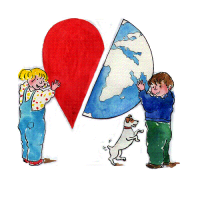
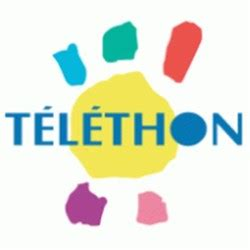

Alors que le froid se fait de plus en plus pugnace, que l'hiver approche à grand pas avec ses menaces de neige, la communauté francophone des Pays-Bas s'organise et appelle au partage.
{.right}

## La Kermesse Francophone
J'ai déjà évoqué [la kermesse francophone](http://www.kermessefrancophone.nl/navigatie1.htm) [il y a deux ans](/une-semaine-francaise). Cette année, encore, la kermesse francophone rassemblera les petits et les grands autour de nombreux stands ludiques et appétissants. Ça se passe aujourd'hui (samedi 27 novembre 2010) de 12h00 à 18h30, à **La Haye**, Sorgvliet Gymnasium, Johan de Wittlaan 22 (en face de l?Omniversum et du Museon).

## Le Téléthon

Ce n'est pas parce qu'on n'a pas la télé française qu'on ne peut pas participer au Téléthon. Ce grand rendez-vous français existe aussi aux Pays-Bas depuis plus de 6 ans et, comme la kermesse francophone il est né à La Haye grâce à des parents d'élève du lycée français. L'année dernière, le Téléthon est arrivé pour la première fois à Amsterdam, porté entre autres par les personnels du consulat. Une fière équipe de sportifs s'est relié pendant 24 heures pour ramer le plus loin possible. Chaque kilomètre (virtuel, il s'agit d'aviron en salle) est acheté par des sponsors au profit de l'AFM. 

Rappelons que l'[Association Française contre les Myopathies](http://www.afm-telethon.fr/decouvrir-l-afm/), à l'origine du Téléthon, consacre l'argent récolté à la guérison des maladies neuromusculaires et apporte une aide aux malades.

{.left} L'édition d'Amsterdam a si bien marché que cette année c'est dans cette ville que le Téléthon aura lieu les 3 et 4 décembre prochain, au [club d'Aviron de Hoop](http://dehooptest.wordpress.com/). Pendant 24 heures, des muscles sains vont se démener pour aider ceux qui n'en on pas. Autour de ce défi, le [programme](http://telethonpays-bas2009.blogs.afm-telethon.fr/programme/) est chargé: concerts, soirée, brunch, spectacles et danse. On vous y attend tous.

Lire aussi : [Une semaine française](/une-semaine-francaise)
---