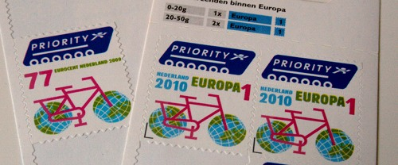

Je vous ai déjà indiqué le coté pratique de la tarification postale néerlandaise. Elle est tellement simple que je peux vous la résumer à nouveau en quelques mots. Il y a trois tarifs: Pays-Bas, Europe et reste du monde. L'affranchissement dépend du poids du pli et à chaque nouveau palier de poids il faut rajouter un timbre. 

Ainsi il faut payer 44 centimes pour une lettre de moins de 20g pour les Pays-Bas et 88 centimes entre 20g et 50g et 1,32 entre 50g et 100g. Il n'y même pas besoin de calculer le total, il suffit de mettre un, deux ou trois timbre selon le cas. C'est la même chose pour l'Europe et le reste du monde.

Les tarifs ont quelque peu augmenté (12% en 4 ans) depuis la première fois que je vous ai parlé des [tarifs postaux néerlandais](/les-tarifs-postaux) mais le principe subsiste. Le *timbre* est en quelque sorte l'unité de compte pour les affranchissement.

<!--excerpt-->

## 1er mai 2010 : changement

Pas étonnant que la [TNT Post](/la-poste-prends-les-couleurs-d-halloween) en fasse l'unité de compte **officielle** des affranchissements. À partir du premier mai 2010, les timbres des Pays-Bas, ne portent plus leur mention tarifaire en centimes d'euro mais uniquement en unité de compte postale. Les timbres n'affichent plus *44*, *77* et *95* mais **1**, **Europa 1** et **Werld 1**. Même le timbre *88* pour les envois de plus de 20g a été réédité avec un **2**. La gamme des timbres d'usage courant a été présentée en ligne pour l'occasion (voir ci-dessous).

{.center}

Les Pays-Bas copie en cela d'autres pays comme la France utilisent des [timbres sans valeur faciale](http://en.wikipedia.org/wiki/Non-denominated_postage) mais avec des codes couleur depuis plus de 5 ans ou le Royaume Uni qui utilise les codes *1st class*, *2nd class* depuis le début des années 90.
