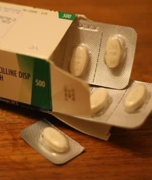

{.left} Un nouveau problème de santé me permet de vous parler de la manière très parcimonieuse que les néerlandais ont pour pour délivrer les médicaments. **C'est un exemple à suivre** parce qu'il évite le gâchis et préserve les assurances maladie de dépenses inutiles.

Ici, **les pharmaciens ne délivrent que le compte exact de médicaments prescrits**. Si le médecin prescrit 2 comprimés par jour pendant 3 jours, cela fait 6 comprimés. Si ce dernier est vendu par boite de 10. La boite sera vidée des 4 comprimés en trop. Pour ma part, j'avais une ordonnance pour 3 cachets antibiotiques par jour pendant 7 jours. Les cachets étant vendus par boites de 20, je me suis retrouvé avec un vingt-et-unième cachet bonus soigneusement découpé et ajouté dans une boite de 20.

Les personnes n'ayant pas droit à la boite fournie par le fabricant du médicament se font délivrer les plaquettes incomplètes dans des boites génériques et la notice est imprimée à nouveau pour le patient. Les notices imprimées sont d'ailleurs plus claires et explicites que les notices des labos pliées dans le fond des boites.

La France, avec son record de consommation de médicaments pourrait s'inspirer ce cette façon de faire pour réduire substantiellement la dépense... Qu'en pensez-vous ?
