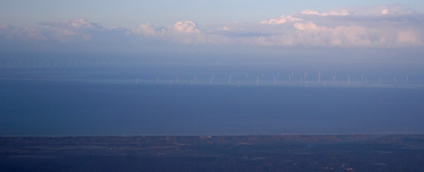

Depuis son inauguration en 2006, je voulais vous présenter l'**un des premier parcs éolien offshore d'Europe**, le parc éolien d'Egmond aan Zee (OWEZ). 200 millions d'euros d'investissement, d'énormes travaux spectaculaires pour (ne) produire (que) **108 Megawatt**[^1] grâce à 36 turbines Vestas V90 3MW alignées à 10 km de la côte, au large de la ville d'**Egmond aan Zee**. Voici quelques images de son installation: 

<!-- HTML -->

<object width="480" height="385"><param name="movie" value="http://www.youtube.com/v/JJ3glbhLBYM?fs=1&amp;hl=en_US&amp;color1=0xe1600f&amp;color2=0xfebd01"></param><param name="allowFullScreen" value="true"></param><param name="allowscriptaccess" value="always"></param><embed src="http://www.youtube.com/v/JJ3glbhLBYM?fs=1&amp;hl=en_US&amp;color1=0xe1600f&amp;color2=0xfebd01" type="application/x-shockwave-flash" allowscriptaccess="always" allowfullscreen="true" width="480" height="385"></embed></object>

<!-- / HTML -->

L'ouverture de ce parc éolien a fait l'objet de [débats à la télé](http://nos.nl/artikel/94088-bedrijven-willen-windmolenpark-in-noordzee.html). On s'est rendu compte s'il en était besoin que l'énergie éolienne n'allait pas remplacer les énergies fossiles dans la production d'électricité mais qu'elle allait aider à consommer moins de charbon ou de pétrole. 

Et puis voilà le temps passe et c'est n'est plus le seul **parc éolien en mer du Nord**. Cet alignement d'éoliennes, gérées par [la société Noordzeewind](http://www.noordzeewind.nl/) (*vent de mer du Nord*), consortium emmené par **Nuon**, entreprise locale de distribution d'électricité et **Shell** a montré l'exemple. Un peu plus au sud, 30km au large d'IJmuiden, un autre parc, [le Prinses Amaliawindpark](http://www.prinsesamaliawindpark.eu/nl/windpark.asp) a vu le jour. Conçut par Eneco, une autre entreprise de distribution d'électricité, le parc a commencé à fournir ses premier watts en février 2009.

Je vous en parle aujourd'hui parce qu'il m'est arrivé de survoler la côte un matin d'automne et mon hublot m'offrait la vue de ces deux parcs l'un derrière l'autre au large des dunes de la côte hollandaise.

[{.center}](http://commons.wikimedia.org/wiki/File:Egmond-aan-Zee-Windfarm.jpg)
---
[^1]: 108 Megawatt permettent quand même de fournir de l'électricité pour 100.000 habitations ce qui n'est pas négligeable.
<!-- post notes:
http://www.energieportal.nl/Nieuws/Windenergie/Eerste-windmolens-Offshore-Windpark-Egmond-aan-Zee-geplaatst-806.html
http://www.power-technology.com/projects/egmond/ 
http://therbelot.free.fr/monde/NL_eolien.html 
http://www.noordzeewind.nl/
http://nos.nl/artikel/94088-bedrijven-willen-windmolenpark-in-noordzee.html 
http://www.nuon.com/nl/het-bedrijf/innovatieve-projecten/noordzeewind.jsp 

NOPE DEMENTI:
Mais l'histoire ne s'arrête pas là, encore plus au sud, un nouveau parc éolien a été construit. Comme [nous le rappelle les bulletins électroniques|  http://www.bulletins-electroniques.com/actualites/50781.htm], ce parc, implanté à 30 km des cotes de __Scheveningen__ dans la commune de La Haye aura une capacité de production d'énergie électrique de 300 MW, trois fois plus importante que le parc d'Egmond aan Zee. Commencés en 2007, les travaux d'installation devraient se terminer en 2011. 
À cette date, la production électrique des Pays-Bas en mer dépassera les 500 MW. Soit la moitié de la production d'une bonne grosse centrale au gaz ou charbon qui fume à la périphérie de nos villes.
--->
