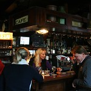

Le [premier janvier 2008](/deux-nouvelles-annees), **les Pays-Bas et la France** faisaient, en même temps, entrer en vigueur une loi prononçant **l'interdiction de fumer dans tous les lieux publics**, cafés et discothèques compris. Je saluais l'ingéniosité des néerlandais ayant décidé de n'appliquer la loi qu'à partir de juillet pour permettre aux gens de prendre l'habitude de fumer dehors alors qu'il fait meilleur.

[{.left}](http://www.flickr.com/photos/13274211@N00/3306652628/) Au mois de juillet, [j'ai refait le point](/pays-bas-sans-tabac) indiquant que la loi était plutôt bien suivie... c'était quinze jours après l'application de cette loi. Tout allait bien, une loi de santé publique était acceptée, votée et appliquée. C'était en 2008. [La presse Néerlandaise](http://www.ambafrance-nl.org/france_paysbas/spip.php?article10395) indiquait des conséquences économiques limités.

<!--excerpt-->

L'année suivante les syndicats de cafés on commencé un intense lobbying pour mettre fin à cette interdiction. Les petits cafés traditionnels néerlandais ferment les uns après les autres comme partout en Europe. Mais depuis 2009 aux Pays-Bas la raison principale en est l'interdiction de fumer. En mai 2009 [une cour d'appel décidait](http://www.ambafrance-nl.org/france_paysbas/spip.php?article10914) que les petits cafés sans personnels pouvaient être considérés comme des lieux privés et donc ne pas tenir compte de l'interdiction. Ce jugement a été cassé par la suite mais c'est la première information qui a le mieux circulé. **Les gens se sont remis à fumer dans les bars**.

Le fait que les représentant des cafetiers néerlandais soient [pris la main dans le sac](http://www.laurentchambon.net/2009/06/le-tabac-la-main-dans-le-sac.html) comme étant financés par les industriels du tabac n'y fait rien, depuis 2009, une fronde de cafés s'organise, partout l'interdiction est bravée, tenanciers de bar et clients fument dans tous les cafés du pays[^1]. Tout porte à croire que cette loi n'existe plus.

Pourtant la loi s'applique bel et bien et certains cafés le redécouvre en prenant des amendes. Ces dernières ne sont pas assez dissuasives pour stopper la fronde. Il n'y a plus que les parlementaires qui pensent encore que cette loi est appliquée sur le terrain. Au cours de [la campagne des législatives 2010](/chaises-musicales-et-politiques). Le VVD s'est prononcé en faveur de l'assouplissement de cette loi. Il est rapidement suivit sur ce sujet par le CDA. Pour les partis de droite classique, ce sujet est populiste à souhait et permet de récupérer des voix chez Gert Wilders tout en tapant sur «la gauche technocratique qui ne comprend rien aux réalités économiques du terrain».

Suite à cette promesse, le [gouvernement minoritaire VVD - CDA](/un-gouvernement-minoritaire), soutenu par le PVV, a bien entendu ajouté **la levée de l'interdiction de fumer dans les petits cafés** à son projet de gouvernement. Cette loi devrait être rapidement présentée. Les anti-tabac et les spécialistes de la santé publique sont furieux mais au moins les cafetiers respecteront la loi[^2].

---
[^1]: Je l'ai constaté à plusieurs reprise à Amsterdam bien sûr mais aussi en Overijsel, en Frise ou à La Haye.
[^2]: Pour ce qui est de l'interdiction de fumer...
<!-- post notes:
http://leforum.nl/index.php/events-section/38-evenements/231-assouplissement-de-lainterdiction-de-fumer-dans-le-secteur-de-la-restauration
--->
