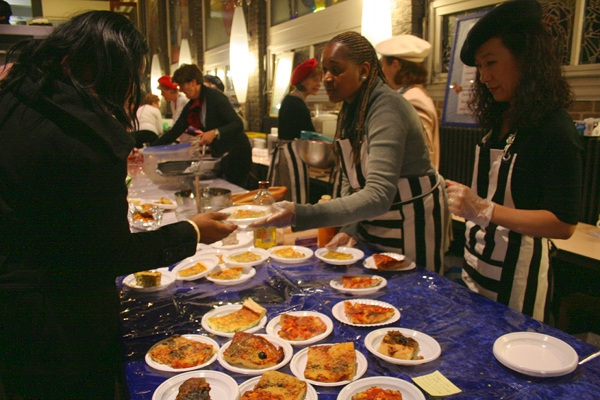
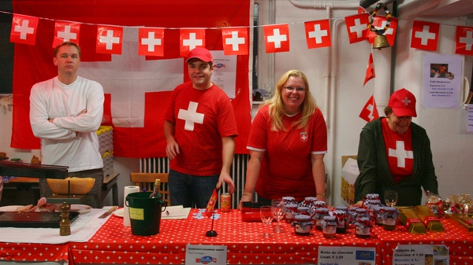
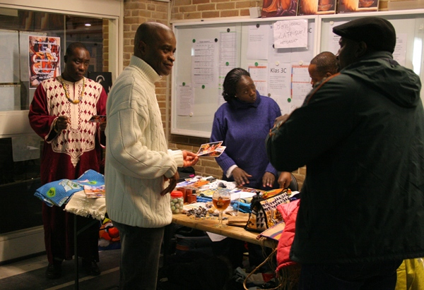
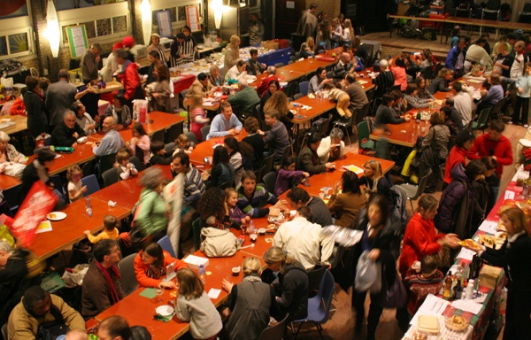
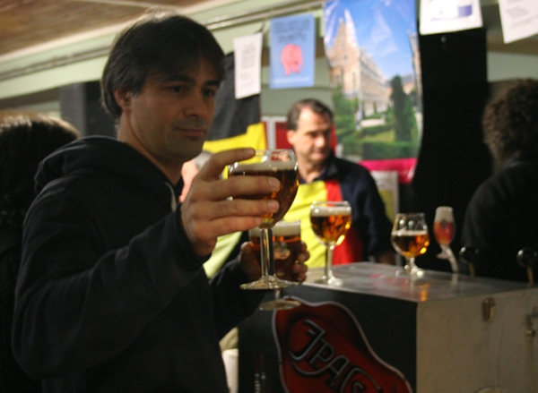
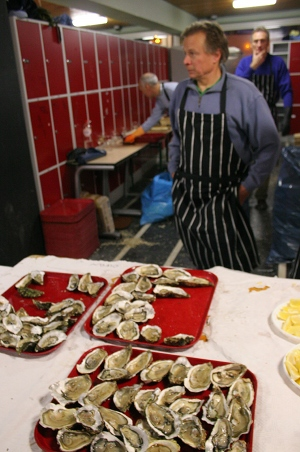
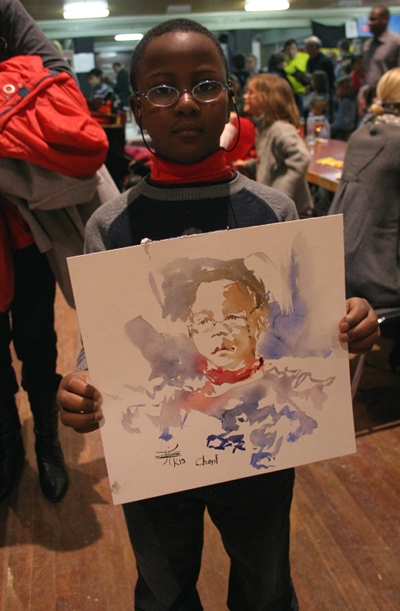
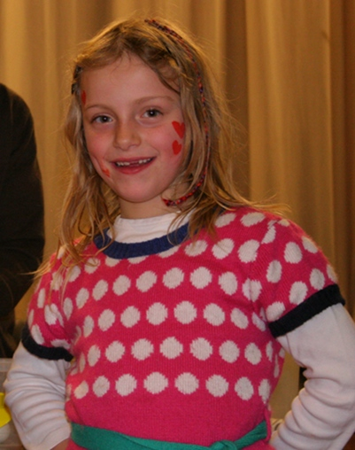
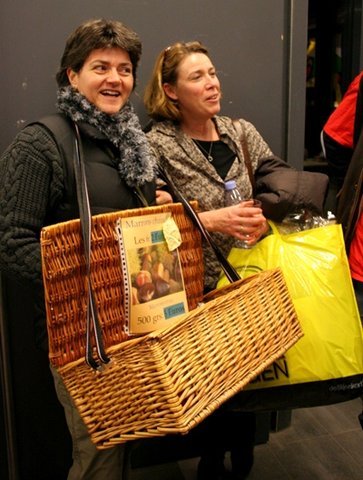

J'en ai parlé récemment, [la kermesse francophone](/solidarite-francophone), à La Haye, est une institution. Depuis 40 ans, c'est le plus gros évènement de charité francophone en pays batave. J'y suis allé la semaine dernière, et comme le montre les photos, c'est un gros truc.

<!-- HTML -->

<!-- / HTML -->

  
Plein de stands avec de bonnes choses à manger, italien, africain, égiptien... ici il y a de bonnes quiches

  
Les suisses sont là avec fromages et chocolats

  
À l'étage, une brocante et des stand expo, ici de l'artisanat africain

  
Une grande salle de banquet qui ne désemplit pas

  
De la bonne bière sur le stand de la Belgique

  
L?écailler vous propose ses huitres fraîches 

  
À l'étage, un grand espace dédié aux enfants. Certains se sont fait tirer le portrait

  
En sortant de l'atelier maquillage

  
Les marchands de marrons de l'ADFE

<!-- HTML -->

<!-- / HTML -->

Le samedi suivant c'est au tour d'Amsterdam d'accueillir un évènement francophone de bienfaisance. [Le téléthon](http://telethonpays-bas2009.blogs.afm-telethon.fr/programme/) aux Pays-Bas. Le programme est alléchant. Il y a des chalenges sportifs mais aussi des expos photos de la danse et des concerts.

## Lire aussi
* [Nouveau mot : Kermesse](/kermesse-kermis)
* [Solidarité francophone](/solidarite-francophone)
* [Les rendez-vous francophones de la fin d'année](/rendez-vous-francophones-fin-d-annee)
---