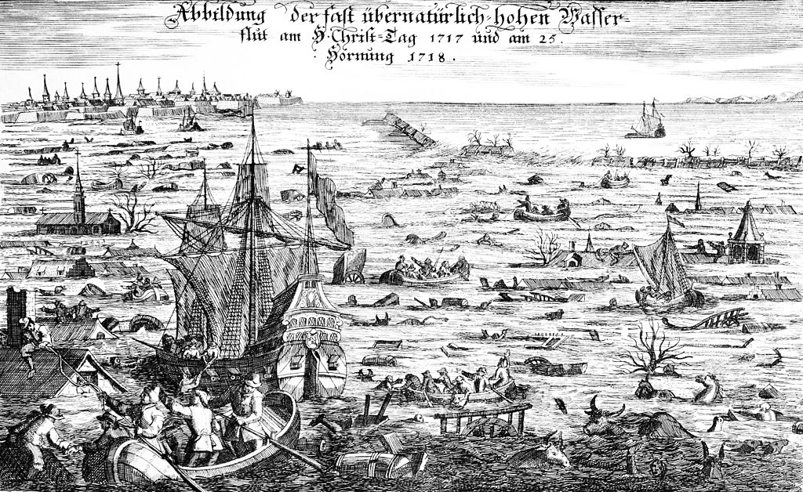

Noël est une journée de joie et de fête surtout dans le monde chrétien. Mais ce n'est pas pour tout le monde, souvenez vous de la tempête il y a 11 ans ou du tsunami il y a 6 dans. De grandes catastrophes naturelles dont les gens se souviennent. Les Pays-Bas aussi ont eu leur lot de **catastrophe de fin d'année** avec cette inondation de noël.

## La nuit du 24 au 25 décembre 1717

La nuit du 24 au 25 décembre 1717, une forte tempête a provoqué un ras de marée qui a touché les côtes néerlandaises, allemandes et danoises. La Hollande, la Frise, Zwolle, Groningue la vallée le l'Ems, La Frise Orientale, la vallée de la Weser jusqu'à Brème, le Duché de Schleswig jusqu'à Tønder au Danemark. La carte ci-dessous en dit long sur l'étendue des dégats.

[{.center}](https://commons.wikimedia.org/wiki/File:Joh._Bapt._Homann_-_Geographische_Vorstellung_der_j%C3%A4merlichen_Wasser-Flutt_in_Nieder-Teutschland.jpg)

<!--excerpt-->

Le ras de marré a été créé par un fort coup de vent de Nord-Ouest survenu cinq heures avant la marée habituelle. La mer a brisé les digues et s'est engoufré dans les zones côtières, les marais et les terres de basse altitude. Des villages entiers ont été submergés par les eaux. Les pertes furent considérables. On a dénombré 9000 morts entre la Frise Orientale et le Danemark. Les Pays-Bas ont eu à déplorer 2500 morts. Les pertes matérielles furent aussi énormes, des centaines de fermes détruites et des milliers de têtes de bétail noyées.

[{.center}](https://commons.wikimedia.org/wiki/File:Christmas_flood_1717.jpg)

## Nouveau mot : Kerstvloed
Au Pays-Bas cette inondation est connue sous le nom d'**inondation de noël 1717** (*Kerstvloed 1717*).

Les conditions pour les survivants ont été difficiles pendant de nombreuses années, malgré les aides reçues. Les semences avaient été détruite et la mer a laissé beaucoup de sel dans les sols. Les rendements étaient mauvais pendant des années et même le bétail survivant ne pouvait pas se nourrir convenablement.. De plus, la population, moins nombreuse après la catastrophe, a mis beaucoup de temps à réparer les digues.

La nuit du 25 au 26 février 1718, une autre tempête provoqua à nouveau des inondations qui, conjugués à une forte chute de neige aggravèrent les dégâts de décembre.

### Voir aussi:
- [Dimanche à Biesbosch](/dimanche-a-biesbosch) ou je parle des inondations de la Sainte Élisabeth.

Merci à [Wikimedia commons](http://commons.wikimedia.org/wiki/Commons:Picture_of_the_day) d'avoir mis la gravure ci-dessus *image du jour* noël dernier.
