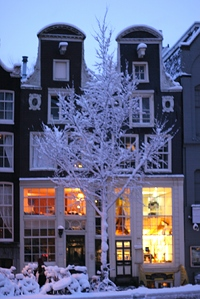
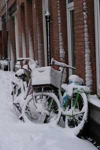

Si l'on regarde la météo, on comprend que l'automne est terminé depuis longtemps. Il est donc temps de parler des marronniers[^1] de l'hiver même ci ces derniers sont plus jolis [en automne](/les-marronniers-de-l-automne).

[{.left}](/public/images/photos/2010-12/neige-canaux-s.jpg)
## Nouveau mot: Witte Kerst
*Witte Kerst* signifie **Noël Blanc**. Comme dans toute langue ou le mot noël est associé à blanc, cela signifie **Noël sous la neige**. La presse quotidienne nous sert cette nouvelle comme si s'en était une depuis que la neige est tombée un peu partout en Europe. La météo annonce de la neige pour les 24 et 25 décembre. Aux Pays-Bas il faut aussi compter le 26[^2]. Ce pourrait donc être le cas cette année. Une page recense le nombre de [noël blancs en province de Twente](http://www.weerstationlosser.nl/historie/feestdagen/Wanneer%20een%20witte%20Kerst/page.htm). Il semblerait que cela se passe avec une constance irrégulière mais certains vont nous parler de dérèglement climatique...

## Qui dit neige...
... dit problèmes de transports. Dans les pays où la neige ne tombe qu'une fois tous les trois ans, il n'y a généralement pas d'équipe dédiée pour déblayer les voies de communication en temps et en heure. Résultat, aux premières chutes de neige, [les trains](/?q=trains) et [les avions](/?q=avions) sont soit annulés soit retard. Quand au trafic automobile, il est comme en France, pire qu'avant la neige. Ce week-end **je me suis retrouvé coincé une heure dans un train immobile** (La Haye - Amsterdam) parce qu'un échangeur était bloqué (lui aussi). Je commence à avoir l'habitude des [retards de la NS pour raison climatiques](/le-mauvais-temps). Comme l'année dernière, [les Thalys ne peuvent pas être à l'heure par temps de gel](/le-thalys-a-moins-grande-vitesse). N'oubliez pas de d'envoyer vos [demandes de compensation au bon service client](/thalys-comparatif-des-services-clients).

[{.right}](/public/images/photos/2010-12/neige-velos.jpg)
## Drooderfiets a froid
Mon vélo aussi a des problèmes de transport. La neige est glissante et donc source de chutes. J'ai essayé de donner un peu plus de mordant à la route en suivant les conseils d'un vendeur de vélos hollandais à Seattle. [Seattle Snowpocalypse](http://www.dutchbikeco.com/_blog/Dutch_Bike_Co_Weblog/post/Seattle_Snowpocalypse/) nous explique que les colliers de serrage rendent à la roue son adhérence. c'est sans compter sur les tronçons sablés de mon trajets. les aléas de la route ont cassé un à un les colliers de serrage, durcis par le froid. La conduite du vélo doit donc s'adapter à la neige de manière classique: **pas d'accélération ou de freinage brusque** et **tourner sans se pencher** de préférence sur une route non accidentée. Finalement, mon plus gros problème avec ce froid n'est pas la route mais le gel. Les vitesses de mon Nexus 7 sont bloquées. Heureusement, la poignée est calée sur une position standard.
---
[^1]: [Selon Wikipedia](http://fr.wikipedia.org/wiki/Marronnier_%28journalisme%29), Un marronnier en journalisme est un article d'information de faible importance meublant une période creuse, consacré à un évènement récurrent et prévisible.
[^2]: Lire [les Noël des Pays-Bas](/noel-des-pays-bas)