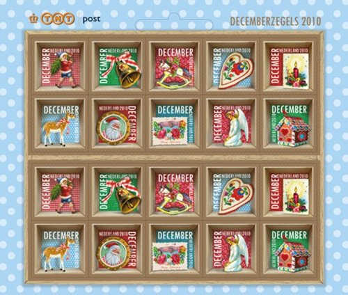

En 2010 comme dans et comme tous les ans, [TNT](/la-poste-prends-les-couleurs-d-halloween), la principale compagnie postale Pays-Bas, lance ses [timbres de saison](/timbres-en-promo). Grâce à ces timbres il est possible d'envoyer de jolis cartes de voeux pour un coût moindre que [le tarif habituel](/augmentation-du-prix-du-timbre). Les timbres [s'achètent](http://onlinewinkel2.tntpost.nl/pages/detail/s1/10220000001123-2-21010000000080.aspx) par planche de 20 au prix de 6,80 ? au lieu de 8,80 ? au tarif habituel.

Les timbres sont plus petits que [les années précédentes](/les-timbres-de-saison). Ils ont été dessinés par [le studio de design PiP](http://www.pipstudio.com/), réputé pour ses dessins kitchs avec référence ménagère. 

{.center}

Cette fois encore, l'achat de 3 planches de 20 timbres de saison donnent droit à un agenda de bureau gratuit. [Cet agenda](http://www.pipstudio.com/nl/kerstkaarten/kaarten/3-velletje-decemberzegels-gratis-thuisagenda) est, encore cette année, très kitch. Il a lui aussi été designé par le studio sus-cité.

## Pas de valeur faciale.
La nouveauté de cette année 2010 tient du fait que les timbres n'ont aucune valeur affichée. Pas même le «1» que l'on retrouve sur les timbres d'usage courant [depuis qu'ils ont adopté une nouvelle numérotation](/timbres-nouvelle-numerotation). La seule inscription, en plus du milésime, est *DECEMBER* qui signifie **décembre**, et résume de manière sybiline, l'ensemble des règles à connaître pour leur utilisation. Ces timbres sont valables jusqu'au 6 janvier pour l'envoi d'une carte de vœux jusqu'à 50g aux Pays-Bas. Ils devraient rester valables après moyennant l'ajout d'un supplément de 10 centimes.

## Pas de tarifs avantageux pour l'étranger
En 2007, j'indiquait que les envois de cartes pour l'étranger bénéficient d'un acheminement rapide au tarif économique. Hélas, avec la nouvelle numérotation des timbres, il semble que le tarif lent n'existe plus. Il n'y a donc plus d'avantage pour ceux aui ont beaucoup de famille à l'étranger. Une ségrégation de plus qui est bien dans l'air du [nouveau gouvernement du pays](/en-vrac-et-debut-octobre).

**voir aussi:**

* [Timbres de décembre en 2006](/augmentation-du-prix-du-timbre)
* [Timbres de décembre en 2007](/timbres-en-promo)
* [Timbres de décembre en 2008](/les-timbres-de-saison)
* désolé, je n'ai pas ceux de  2009
* désolé, je n'ai pas ceux de 2011
*  [Timbres de décembre en 2012](/Les-timbres-de-decembre-ont-25-ans)
---