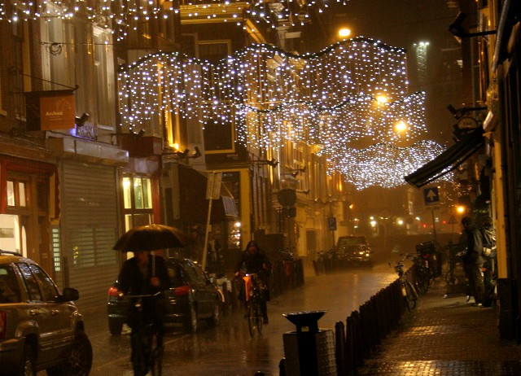

Saint Nicolas est passé et les enfants sages ont eu leur cadeaux. Tout le monde est content, les [zwarte piets](/qui-est-tu-zwarte-piet) on disparu des vitrines et ont été remplacés par des décorations de noël. Cette autre fête importante permet encore aux commerçants de faire des affaires. Autant Saint Nicolas est une tradition bien néerlandaise que le pays a su conserver, autant noël subit les influences de ce qu'il se passe en divers pays pour célébrer cette fête.

<!--excerpt-->

## Les décorations de noël

[{.center}](http://www.flickr.com/photos/13274211@N00/5255570946/)

Elle sont présentes dans chaque rue commerçante, payées par les magasins qui donnent ainsi un cachet à leur rue. Par exemple les décorations des [9 ruelles](/les-neuf-ruelles-9-straatjes) portent un gros **9**. Les décorations de fin d'année sont aussi là pour la Saint Nicolas car on commence à les accrocher dès début novembre. 
Je ne connais pas l'origine des décorations de fin d'année. On peut peut être les attribuer à Lyon qui fête les lumières à la même époque. Les juifs aussi fêtent les lumières [à Hanouka](/nouveau-mot-chanoeka).

## Les marchés de noël
Les marchés de noël à l'allemande ont leurs baraques en bois qui vendent des produits pseudo artisanaux et du *glüwein*. Depuis longtemps ces marchés ont envahi les villes européennes. Les néerlandais y ont ajouté des stands de [poffertjes](/les-poffertjes) et de [croustillons](/les-oliebollen-ou-croustillons). Les marchés de noël sont présent dans tout le pays, [voyez la liste](http://www.hollandsemarkten.nl/braderie/index.php?nav_id=1.2.9&b=9&a=overzicht).

## Les tenues de soirée
Les boutiques de mode alignent les mannequins sur leur trente-et-un. **Costumes et robes de soirée** à des prix variables mais qui prétendent toujours être de bonnes affaires. Je ne sais pas d'où vient cette tradition d'être bien sapé pour les fêtes de fin d'année mais c'est encore une fois une tendance européenne. J'ai vu beaucoup de vitrines avec des sous-vêtements rouges, je ne sais pas si c'est une couleur de saison ou si c'est une tentative d'importer cette tradition italienne, consumériste et sexy.

## Les soldes
Aux Pays-Bas, les soldes commencent avant noël. Je n'ai pas l'impression qu'il y ait de date précise pour l'ouverture des soldes comme en France. Il faut savoir qu'aux Pays-Bas les soldes sont lieu à un peu n'importe quel moment de l'année. Moins régulées qu'en France mais aussi moins intéressantes qu'au Royaume-Uni, les soldes néerlandaises sont une vaste fumisterie. La plupart du temps ce ne sont pas de vrai soldes. Il est possible de trouver le même produit, non soldé à moins cher, un peu plus loin dans la même rue. **Se méfier des soldes** aux Pays-Bas, surtout à noël.

## Les sapins
Comme dans de nombreux pays, les néerlandais participent au plus gros **carnage de jeunes arbres** de l'année. La tradition scandinave d'aller chercher son arbre dans la forêt s'est adapté à la société moderne. Les néerlandais achètent leurs sapins chez les fleuristes ou dans les supérettes et ramènent ce bois vert à vélo comme le montre ce [reportage de Amsterdamize](http://amsterdamize.com/2009/12/13/seasonal-cycling/).

## Les chansons de noël
Les chanteurs anglais et étasuniens aiment bien sortir des **chansons de noël**. Ils savent qu'avec un peu de chance ils se retrouveront sur une compilation de noël aux cotés de Band Aid, Wham# ou John Lennon. Les Néerlandais raffolent de ces compilations de saison. 4 magasins sur 5 passent en boucle ces chansons de noël et les playlists des radios s'agrémentent de chansons avec cloches et grelots. Cette tradition anglo-saxone a vraiment bien pris ici et on entend parfois des adaptations bataviennes de chansons de noël, comme cette [chanson de Kus](/chanson-de-noel) que je vous ai présenté en 2006.
