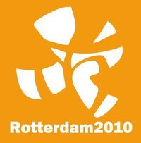

 La Communauté de Taizé organise pour le Nouvel An des rencontres de cinq jours dans une ville d'Europe. Cette année les rencontres on lieu à Rotterdam. C'est une rencontre chargée de symboles que cette première rencontre aux Pays-Bas depuis 32 ans que ces rencontres existent.

{.center}

La communauté [œœcuménique](http://fr.wikipedia.org/wiki/%C5%92cum%C3%A9nisme) se rend dans une terre qui a vécu lourdement l'opposition entre [catholiques et protestants|] à un moment ou les chrétiens ne sont plus une référence de société. Le scandale des prêtres pédophiles dans l'église Catholique et la cuisante défaite d'un gouvernement Balkenende IV qui voulait ramener une certaine morale protestante dans la société. Les rencontres s'adressent aux jeunes que tout cela dépasse mais les communautés locales qui assurent l’accueil vont enfin partager des moments plus réjouissants. 

<!--excerpt-->

<!-- HTML -->

<iframe width="560" height="315" src="https://www.youtube.com/embed/05FMYA6sWvw?si=WIfcAdpAuP5knpD8" title="YouTube video player" frameborder="0" allow="accelerometer; autoplay; clipboard-write; encrypted-media; gyroscope; picture-in-picture; web-share" referrerpolicy="strict-origin-when-cross-origin" allowfullscreen></iframe>

<!-- Gone <iframe src="http://player.vimeo.com/video/15457767?byline=0&amp;portrait=0&amp;color=f07400" width="400" height="225" frameborder="0"></iframe> <a href="http://vimeo.com/15457767">Taize - On the way to Rotterdam</a> from <a href="http://vimeo.com/taize">Taizé</a> on <a href="http://vimeo.com">Vimeo</a>.
 -->
<!-- / HTML -->

## Taizé et les jeunes d'Europe

La [Communauté de Taizé](http://fr.wikipedia.org/wiki/Communaut%C3%A9_de_Taiz%C3%A9) a été fondée par [Frère Roger](http://fr.wikipedia.org/wiki/Fr%C3%A8re_Roger), le fils d'un pasteur protestant suisse qui a choisit ce village de France parce qu'il y avait vécu des moments forts durant la guerre. Avec cette communauté, frère Roger va passer sa vie à œœuvrer pour la réconciliation entre les hommes. Cela passe par une réconciliation entre les chrétiens, la communauté de Taizé accueille des moines de toutes confessions chrétiennes. Ils sont en majorité catholiques mais, jusqu'en 2005, date de la mort de Frère Roger, leur prieur était protestant.

Très vite la communauté se rapproche des jeunes et les exhortent à se réconcilier les uns avec les autres. Quand les rencontres européennes des jeunes voient le jour en 1978 c'est entre l'est et l'ouest que la communauté œœuvre à la réconciliation. Sa renommé s'étendait des deux cotés du rideau de fer[^1]. 

En ces temps de crise économique, la réconciliation passe par l'aide aux plus démunis, autre grand but de la communauté. Le choix de Rotterdam, ville moins en vue et moins huppée que la Haye ou Amsterdam mais tout aussi dynamique et cosmopolite convient très bien à l'esprit de la Taizé. Le Maire de Rotterdam est le brillant Ahmed Aboutaleb, un néerlando-marocain, tout un symbole.

Thème de la rencontre de Rotterdam 2010 est la joie. Cette joie[^2], on espère que les jeunes vont la vivre ensemble et avec leur famille d'accueil puis la ramener au pays, en 2011...

---
[^1]: En témoigne un très bon film de Kieslowski: [le Hasard](http://www.imdb.com/title/tt0084549/) (*Przypadek*)
[^2]: Lire à ce sujet [la lettre de Taizé](http://www.taize.fr/fr_article11721.html)