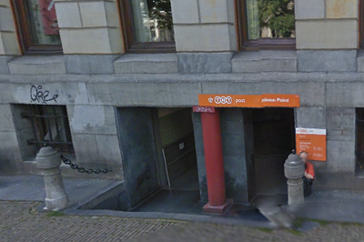

S'il ne doit en rester qu'un, ce sera celui là. Le grand bureau de poste central d'Amsterdam (*Hooftpostkantoor*) vient une nouvelle fois de réduire sa taille pour mieux recevoir le public. Pour y accéder il ne faut plus emprunter la grande porte de cet immeuble XIXe[^1] mais **descendre dans la cave** où vous attendent des distributeurs automatiques et quelques employés rescapés.

{.center}

<!--excerpt-->

Ce local est l'ancien local postal réservé aux entreprises. Il héberge toujours les boites postales du centre-ville mais maintenant il reçoit aussi le public. Les opérations financières n'ont plus lieu aux guichets de cette nouvelle poste. La baque ING a quitté les lieux pour s'établir à 10 minutes d'ici, sur Rokin, la 250ème agence de la banque[^2].

Cet article pourrait être le prétexte pour vous reparler de la [réorganisation de TNT Post](/la-poste-prends-les-couleurs-d-halloween). La poste néerlandaise, privatisée en 1986 mais ayant perdu son monopole seulement depuis le début des années 2000. **TNT Post** poursuit sa réorganisation pour, officiellement affronter la concurrence[^3]. En 2007, l'organisation a annoncé vouloir [fermer des milliers de bureaux de poste](/la-fin-des-bureaux-de-poste), chose qu'elle continue encore aujourd'hui. En 2010, elle a annoncé vouloir se débarrasser de milliers de facteurs. **Un conflit social s'en est suivit**, les facteurs, après plusieurs semaines de grève, ont finalement signé un accord permettant de réduire leur nombre sans qu'il n'y ait de licenciement secs. Du coté de la clientèle, les services sont de plus en plus assurés par des livreurs sous-payés qui multiplient les erreurs. Je ne compte plus les lettres et colis perdus dans mon entourage...

Cet article pourrait aussi être un prétexte pour vous parler des différentes adresses de la poste centrale d'Amsterdam au cours des ages, différents exemples d'architectures de différentes époques. Ce sera peut-être le sujet d'un prochain article.

### Lire aussi
**[Le dernier bureau de poste à Utrecht](/dernier-bureau-de-poste-Utrecht)**
 
---
[^1]: Cet immeuble est celui où je travaille. Il's'appelle *Bankgebouw* parce qu'il a été construit en 1912 par la *Nederlandsch-Indische Handelsbank*. Aujourd'hui, son 3ème et 4ème étage abrite les [bureaux du RIPE NCC](/mon-nouveau-boulot-3)
[^2]: [Annoncée en grande pompe](https://www.eufin.nl/financieel-nieuws/13/21142-ing-opent-250e-kantoor-aan-amsterdamse-rokin), contrairement à la réduction de volume de l'agence postale.
[^3]: Officieusement c'est pour faire des économies et mieux rémunérer les actionnaires.