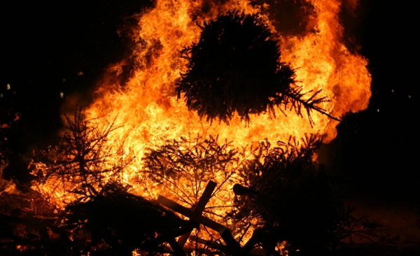
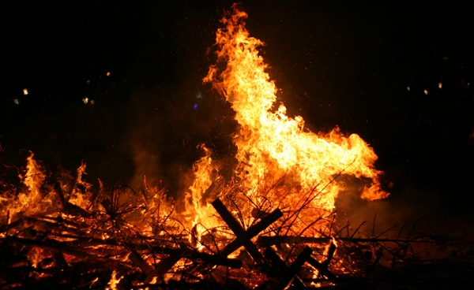
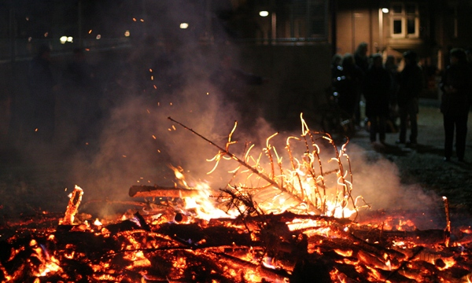
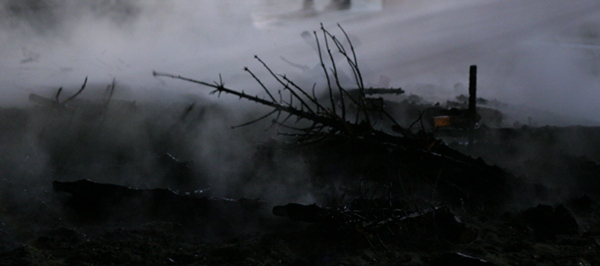

Hier c'était le week-end pour **ranger les décorations de noël** et faire un peu de ménage...

Ça tombe bien, dans la tradition liturgique chrétienne, le temps de noël se termine le deuxième dimanche de janvier avec le baptême de Jésus, une semaine après le passage des rois mages.

<!--excerpt-->

Ça tombe bien parce que le sapin se fait sec et c'est le moment ou jamais de **débrancher les guirlandes**. Il ne reste plus qu'à se débarrasser du sapin qui va soit trainer dans la rue (voir [mes vœux pour 2011](/bonne-annee-2011)), soit être recyclé en compost pour les plus chanceux, soit finir dans un grand feu de joie.

Ça tombe bien, un feu de joie était organisé sur **museumplein** (la place des musées), organisé par le centre des jeunes du quartier. On peut y apporter son sapin qui sera brûlé devant la foule sans procès. Les sapins secs brulent bien et le feu de joie ravit les enfants (et les adultes) qui courent dans tous les sens. Cette grosse fête de quartier était égayée par la fanfare *De Eerste Liefdesnacht* sous l'œil vigilant des pompiers.

Pendant plus d'une heure les gens ont afflué pour se réchauffer auprès du feu et montrer aux enfants que **noël, c'est fini**, tout part est parti en fumée. Les gens apportaient leurs sapins qui étaient jetés au feu un à un, consumant en quelques minutes tout secs qu'ils étaient (les sapins, pas les gens).

<!-- HTML -->

{.center}
*on jette le sapin au feu*

{.center}
*comme prévu, il brule*

{.center}
*le feu se calme*

{.center}
*il reste plus qu'un décor de reste de noël*

<!-- / HTML -->
