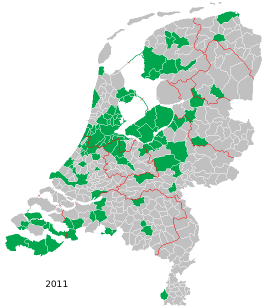

[{.right}](http://upload.wikimedia.org/wikipedia/commons/5/5c/2011-NL-Gemeenten-nl1800px.png)

Depuis le premier janvier 2011 les Pays-Bas comptent 421 communes au lieu de 433 précédemment. Les 433 comptent les 3 dernières communes «BES» des Caraïbes depuis le changement de statut des Antilles néerlandaises survenu le [10 octobre dernier](/en-vrac-et-en-automne). Cela fait presque 3% de pertes pour cette nouvelle année 2011.

Je vous ai déjà explique que les Pays-Bas avait une [politique de regroupement de communes](/regroupement-de-communes) de manière à ce que ces dernières aient au moins 25.000 habitants. Je regrettais déjà à l'époque cette manière d'imposer une dilution de la vie politique locale dans des entités à taille peu humaine alors que les gens se désintéressent déjà de la politique.

La carte du pays que je donnais l'année dernière est donc déjà dépassée. On peut admirer le travail de Janwillemvanaalst sur Wikipedia. Dès le jour de l'an, ce dernier mettait à jour sa carte du pays reproduite ci-contre ([cliquez pour agrandir](http://upload.wikimedia.org/wikipedia/commons/5/5c/2011-NL-Gemeenten-nl1800px.png)).

Cette année, les regroupement sont:

{.left}
* Dans la province de Frise: Les communes de **Bolsward**, **Nijefurd**, **Sneek**, **Wonseradeel** et **Wymbritseradeel** forment une nouvelle commune du nom de **Súdwest Fryslân** (Frise du Sud-Ouest en frison). Ce devient la plus grande commune des Pays-Bas avec 815,97 km². 

* En province d'Utrecht: **Abcoude** se fait absorber par **De Ronde Venen**. Une autre fusion entre **Breukelen**, **Loenen** et **Maarssen** donne naissance à **Stichtse Vecht**. du nom de la rivière qui traverse les trois anciennes entités.

* En Hollande Septentrionale: **Medemblik** absorbe les petites communes d'**Andijk** et de **Wervershoof**.

* En Hollande Méridionale: Les municipalités de **Reeuwijk** et **Bodegraven**  ont prévu de se regrouper en 2011. La nouvelle commune porte le nom de **Bodegraven-Reeuwijk**.

* En Brabant Septentrional: Les communes de Lith et Oss se sont regroupées et la nouvelle commune porte le nom de la seconde.

* En province de Limbourg Néerlandaise: Dans la banlieue de Maastricht, **Eijsden** et **Margraten** on décidé de gérer leur destinées en commun. La nouvelle commune porte le nom original de **Eijsden-Margraten**.

Avec tout ça il me faut remettre à jour ma carte des communes visitées des Pays-Bas. Depuis le 1er janvier, on dirait que j'ai visité plus d'espace mais en fait il y a moins de communes dans mon décompte.

{.center}

## Ce n'est pas fini

* Les [fusions de communes se poursuivent](/fusions-communes-se-poursuivent) ( -3 en 2012, -7 en 2013, -5 en 2014 et -10 en 2015 ! )
---