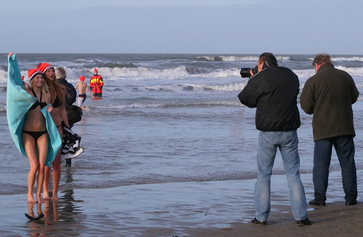
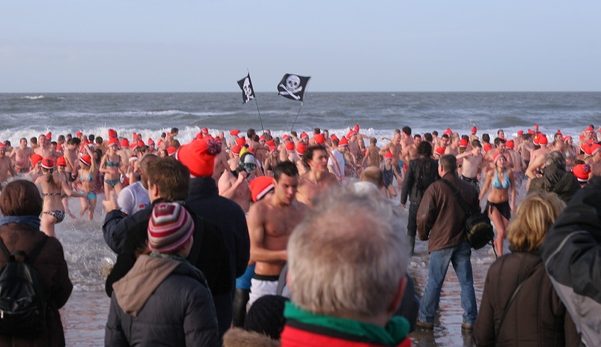
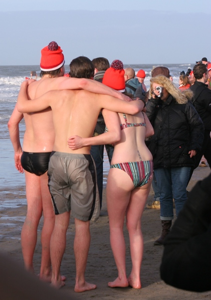
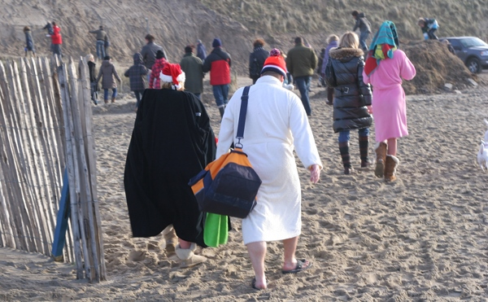

Le premier janvier est souvent l'objet de traditions plus ou moins curieuses. Les habitants des régions côtières aiment par exemple piquer une tête dans la mer en ce premier jour de l'année. Ce pourrait être une bonne idée si le vent du littoral ne faisait tomber la température à un degré proche de la nullitude[^1]

Qu'à cela ne tienne, les néerlandais sont assez fous pour piquer une tête par -5°c. Sur plusieurs dunes **face à la mer du Nord**, les moins frilleux se réunissent pour prendre leur bain du nouvel an. Mais c'est [à Zandvoord](http://www.zandvoortinbeeld.nl/nieuws.php?id=923) que cette tradition à pris le plus d'ampleur. Les gens se réunissent depuis 1960 sur cette plage au sud-ouest d'Amsterdam pour plonger ensemble dans la mer un premier janvier. 

{.center}

Cinquante ans après, ils sont des milliers à venir braver les flots et le froid. Le nombre de participant a explosé en 2004 et l'organisation doit adapter la logistique. Un nouveau sponsor est arrivé aussi. Le marchand de soupes UNOX distribue son célèbre bonnet de ski orange et rétro à tous les participants.

{.center}

En 2007, avec l'annulation de la manifestation équivalente de Scheveningen au large de La Haye, le **plongeon du jour de l'an de Zandvoort** (*Zandvoort Nieuwjaarsduik*) bat un record en enregistrant 1600 inscriptions. Pour la cinquantième, un nouveau record est enregistré avec 1700 participants. Les baigneurs étaient un peu serrés entre leurs barrières mais cela leur a permis de se tenir chaud.

{.center}

Après une séance d'échauffement sur un rythme de techno trash, les baigneurs s'élancent à deux reprises dans la mer. On prend plein de photos pour pouvoir raconter «je l'ai fait» de retour à la maison. Ça ne dure pas longtemps, les participants regagnent leur chauds peignoirs et les stands ou une soupe bien chaude les attend.

{.center}

**Quelques liens du nouvel an :**  
[Gueule de bois ?](/gueule-de-bois)  
[Préparatifs pétaradant](/preparatifs-petaradants)  
[Nouveau mot : Gelukkig](/liens-pour-nouvel-an)  
[Nouveau mot : Vuurwerk](/nouveau-mot-vuurwerk)  
[Il y a eu des dégats](/il-y-a-eu-des-degats)  
[Les bruits du nouvel an](/les-bruits-du-nouvel-an)  
[Ceux nouvelles années](/deux-nouvelles-annees)  
[Pour les vœux, c'est fini](/pour-les-voeux-c-est-fini)  
---
[^1]: Par temps venteux, [la température ressentie est bien moindre](/la-temperature-ressentie) que la température annoncée
<!-- post notes:
http://www.zandvoortinbeeld.nl/nieuws.php?id=923
--->
