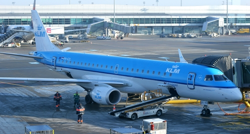
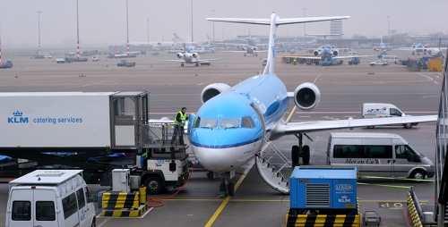

Vous souvenez-vous en 2006 lorsque je vous expliquais que les **Fokker** étaient des avions néerlandais, **les seuls petits courriers affrétés par la KLM**. Ce n'est plus le cas et je vais vous raconter pourquoi. Le titre est un clin d'œil à cet ancien billet, [Hier en Fokker](/hier-en-fokker).

Il y a quelques semaines (ce n'était pas hier), je sur revenu de Prague. Généralement les *Amsterdam - Prague* sont des vols opérés par **ČSA**, les deux compagnies ayant un accord de partage de codes. Mais ce matin là, c'était un vol **KLM**. L'avion que nous a affrété la compagnie des hollandais volants est un petit courrier de 100 places mais **ce n'est pas un Fokker**. C'est un **Embraer 190** tout neuf qui brille, voyez ci-dessous.

[{.center}](http://commons.wikimedia.org/wiki/File:Embraer-190-KLM.jpg)

<!--excerpt-->

Le magazine de bord [Holland Herald](http://holland-herald.com/) nous explique dans ses dernières pages que depuis 2008, KLM introduit les nouveau [Embraer 190](http://fr.wikipedia.org/wiki/Embraer_190) dans sa flotte de *cityhopper* en remplaçant petit à petit les Fokker 100. On remarque sur ces pages que le Fokker 50, dernier avion à hélices de la compagnie ne fait plus partie de la flotte. Son dernier vol a eu lieu [le 27 mars 2010](http://www.nu.nl/economie/2213942/klm-neemt-afscheid-van-fokker-50.html) après surement 15 ans au service de la compagnie. 

Il reste néanmoins des Fokker dans la flotte KLM. 5 Fokker 100 et 26 Fokker 70. Ces derniers sont stationnés sur le tarmac non loin des portes B de **Schiphol**. On peut les voir alignés attendant leur prochain vol ou bien leur réforme.

[{.center}](http://commons.wikimedia.org/wiki/File:Foker-70-KLM-Schiphol.jpg)

