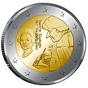

[{.left}](http://commons.wikimedia.org/wiki/File:2011nl-v.jpg)

La nouvelle pièce commémorative de 2 euros néerlandaise, la voici, la voilà. Elle est dans [ma collection](http://alix.guillard.free.fr/euros/) depuis deux jours. C'est ma première pièce avec le millésime **2011** et la deuxième fois que ma première pièce au millésime de l'année est néerlandaise. La dernière fois [c'était en 2006](/2006-nouveau-millesime). 

Autre première, c'est la première fois que les Pays-Bas émettent une pièce commémorative de 2 euros de leur propre initiative. Les précédentes émissions faisaient parties des émissions communes pour le [traité de Rome en 2007](http://fr.wikipedia.org/wiki/Pi%C3%A8ce_comm%C3%A9morative_de_2_euros#.C3.89mission_sp.C3.A9ciale_Trait.C3.A9_de_Rome_2007) et les [10 ans de l'Euro en 2009](http://fr.wikipedia.org/wiki/Pi%C3%A8ce_comm%C3%A9morative_de_2_euros#.C3.89mission_sp.C3.A9ciale_Union_.C3.A9conomique_et_mon.C3.A9taire_2009).

<!--excerpt-->

La pièce a été frappée à l'occasion du 500e anniversaire de l'impression de **L?Éloge de la folie** par **Érasme** (*Erasmus*). On y voit l'écrivain de Rotterdam écrivant les premiers mots de son livre (*Laus Stultitiae* ?) ainsi que effigie de la **la reine Beatrix** et son titre *Beatrix Koningin der Nederlanden*, la reine des Pays-Bas.

En 2007 quand la banque centrale européenne propose l'idée d'une émission commune, le gouvernement néerlandais doit amender sa loi parce que cette dernière indique que **les pièces de monnaie doivent comporter une effigie du monarque**. L'amendement de cette loi n'étant valable que pour les émissions communes, on retrouve la reine aux cotés de l'écrivain. Les Pays-Bas évitent ainsi de devoir se plier à l'une des nouvelles règles pour la conception des euros qui exige que le nom du pays émetteur figure sur la pièce.

----
Pour la petite histoire, j'ai failli louper cette pièce. Ce matin là je voulais aller à [la boulangerie](/le-fournil-de-sebastien) prendre une baguette, mais c'est loin et j'étais en retard. Alors je suis allé à la [supérette](/albert-hein-et-compagnie) du coin prendre des céréales.
