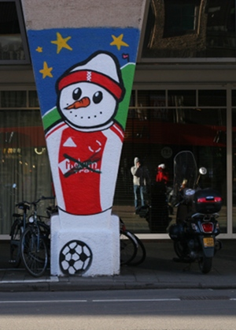

[{.left}](/bonshommes-de-neige-vijzelstraat)
Nous avons eu [beaucoup de neige au mois de décembre 2010](/les-marronniers-de-l-hiver) et certain en ont profité pour faire des bonshommes de neige. Beaucoup de ces sculptures éphémères ont fondu avec le reste de la neige aussi vite que [les sapins de noël ont brulé](/la-fin-des-sapins). Mais il en est resté quelques uns, **des bonshommes de neige sur la Vijzelstraat**. C'est l'expo en plein air de l'hiver.

### Expo en plein air

Il y a longtemps que je n'avais pas parlé des [expos en plein air](/expo-photos-en-plein-air-6) d'Amsterdam. Souvent il s'agit d'expo photo mais pas seulement. Ici l'expo de bonshommes de neige était composée de peintures et sculptures. Ces décoration sont une initiative des [ateliers d'Art et Design de ROC Amsterdam](http://www.rocva.nl/mbo/Opleidingen/Overzicht/Media_Reclame_Kunst_Cultuur/Kunst_Cultuur/Pages/Art_Design.aspx), sponsorisé par la mairie, les hotels NH et la [Noord Zuidlijn](/la-ligne-du-nord-au-sud), ligne de métro qui devrait passer sous cette rue Vijzelstraat [depuis plusieurs années déjà](/travaux-n-en-finissent-toujours-pas).

### Nouveau mot: Sneeuwpop

*Sneeuwpop* signifie **bonhomme de neige**, *sneeuw* signifiant **neige** et *pop* étant la traduction de **poupée**. Les Néerlandais ont bien vu que les bonshommes de neige n'étaient pas des vrais bonshommes. 

Le lancement de ce festival de bonhommes de neige a eu lieu le [8 janvier 2011](http://www.echo.nl/ec-zu/buurt/redactie/1116402/sneeuwpop.festival/) dans la zone de travaux de la Noord Zuidlijn, non loin des [maisons qui menacent de s'écrouler](/les-maisons-s-enfoncent). Les enfants et les gens du quartiers [étaient invités](http://m.echo.nl/ec-zu/buurt/redactie/1119121/sneeuwpoppen.festival/) à rencontrer des vrais bonhommes déguisés en poupées de neige et à admirer les graffitis officiels qui ont parsemé la rue pendant plusieurs semaines.

### Galerie:
<!-- HTML -->

<!-- / HTML -->
  
Les touristes posent devant la hollandaise

  
Un clown

  
Un autre qui se croit encore à noël

  
Le concierge de l'hotel porte un fez

  
Un pirate

  
Un supporter de l'Ajax au t-shirt barré par un autre supporter

  
Le pédé de Regulierdwarstraat

  
Au dessus du Prinsengracht

  
En face de la maison Descartes, ce panneau affirme « Amsterdam est plus belle que Paris » Cartes à l'appui.

  
Un squelette surveille le chantier

  
Des bonshommes de neige font les cons

<!-- HTML -->

<!-- / HTML -->
---