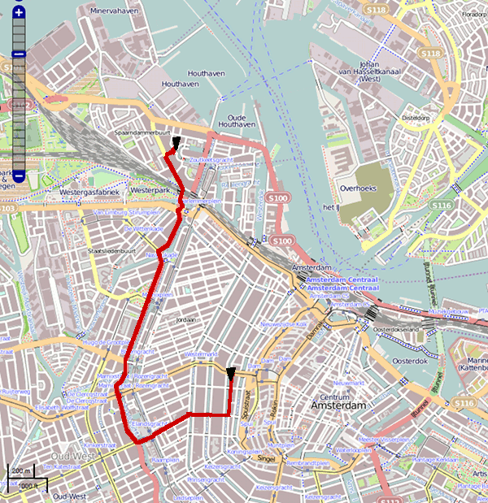
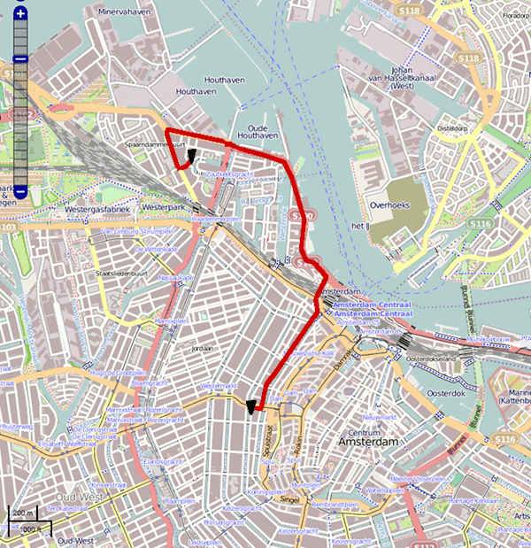
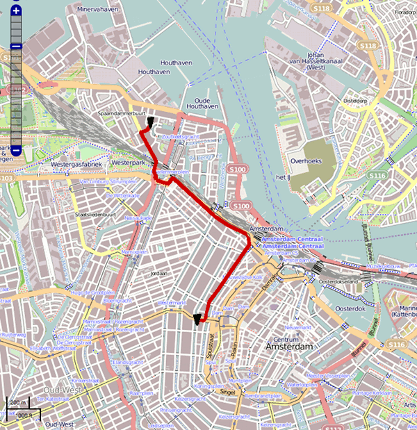
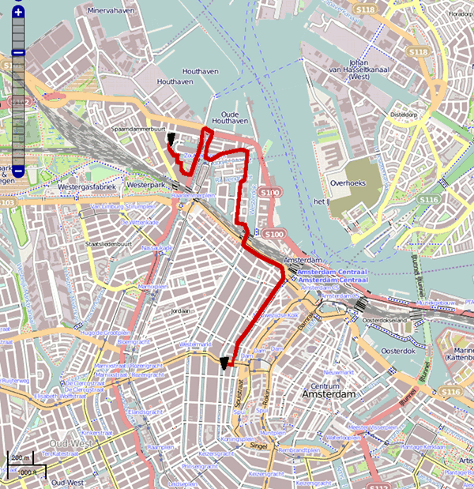
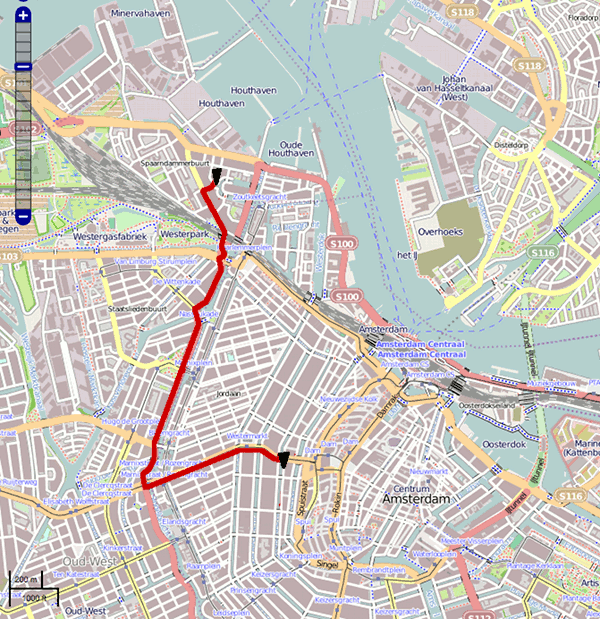
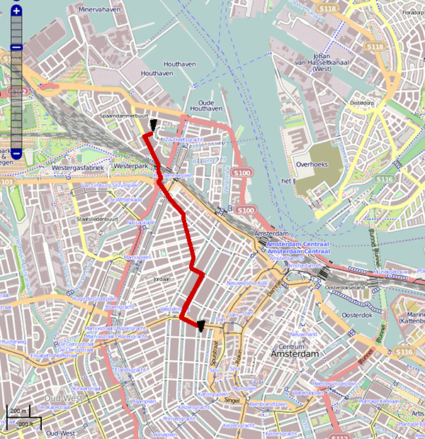
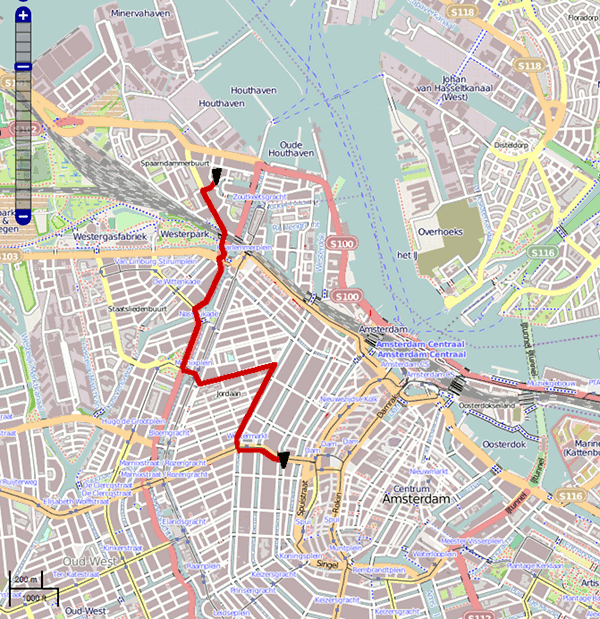
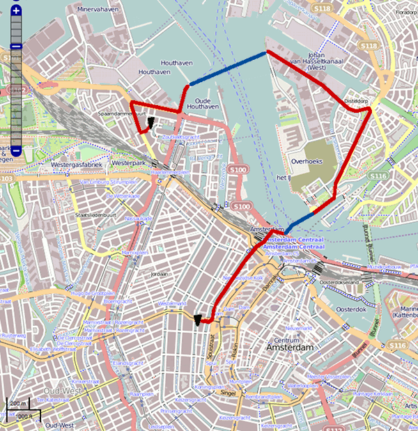
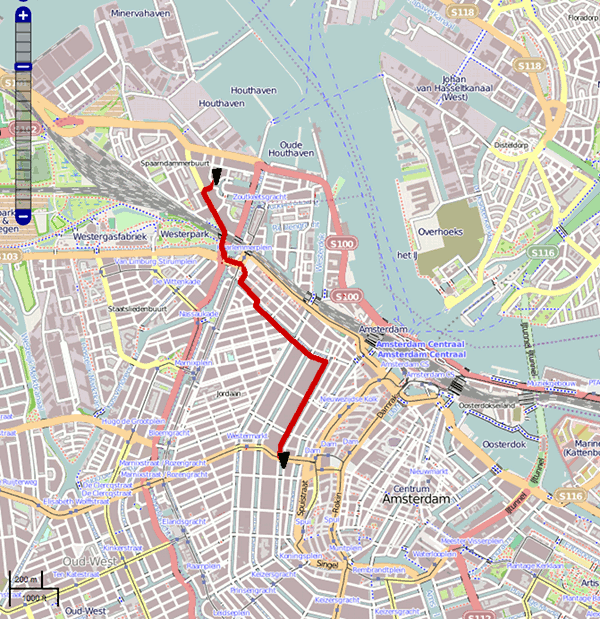

Depuis plusieurs années déjà, je vais travailler [à vélo](/drooderfiets-mon-nouveau-velo), quelques kilomètres en moins d'un quart d'heure et hop, me voilà d'attaque pour une journée de travail. Pas de problème de grève, d'incident technique ou d'embouteillage. C'est un des rares avantages de la vie à Amsterdam que j'apprécie grandement. Depuis que [j'ai déménagé](/mon-nouveau-chez-moi), mon trajet dodo - vélo - boulot a changé. [On m'a demandé sur twitter](http://twitter.com/#!/scrollmac/status/50185498467123200) de vous en faire part. Comme vous pouvez le voir, trouver le chemin le plus efficace n'a pas été facile, cartes à l'appui.

<!--excerpt-->

Le premier trajet maison - boulot a été laborieux. Je suis simplement descendu le long de Nassaukade, sachant que je devais tourner à gauche à moment donné. Je l'ai fait un peu trop tard en fait.

Le soir, pour rentrer du boulot, je tente une sorie par le nord, le long des docks de l'ouest. La boucle en fin de parcourt est inévitable parce qu'il n'est pas évident de tourner à gauche sur la S100, les voitures circulent vite sur cette route.

Un matin plus tard, je tente un chemin plus court le long d'Haarlemerdijk et Haarlemerstraat. Ces deux rues commerçantes sont agréables mais quelque peu encombrées le matin, il faut parfois slalomer entre les touristes et les camions de livraison.

Un soir j'ai réessayé de rentrer par le nord, en coupant par les îles du nord. Mauvaise idée, les îles sont entourées d'eau et il n'y a pas de pont au bout de chaque rue. Ce chemin plus court fait trop de détours

J'ai enfin trouvé le moyen de tourner à gauche au bon moment sur Nassaukade. Il faut emprunter Rosengracht. Un axe rapide et dégagé. Ce chemin est agréable mais l'orientation des rues dans le Jordan donne l'impression de faire un détour.

Entre chez moi et le boulot il y a le Jordan, les rues principales traversent cet agréable quartier du sud-ouest au nord-est. Les emprunter c'est faire un détour. L'idéal serait de couper court par les petites rues de traverse. L'idéal n'est pas idéal du tout, il faut faire plein de petits virages. Ce trajet le plus court est aussi le plus lent.

Quitte à traverser le Jordan, autant faire un détour par Westerstraat. Cette rue possède entre autres deux supérettes ([Albert Hein](/albert-hein-et-compagnie/) et Jumbo) ce qui est pratique pour faire les courses en rentrant du boulot.

Un soir, avec ma manie de partir vers le nord, je me suis retrouvé à prendre le bac pour traverser l'[IJ](/nouveau-mot-ij-2). J'ai fait un tour dans les quartiers nord et j'ai repris un bac plus proche de la maison. Il faisait beau, c'était la petite balade du soir.

Enfin, depuis quelques matins, j'ai trouvé le trajet le plus agréable. Il longe Haarlemerdijk sans en subir l'affluence, il longe le Jordan sans avoir à le traverser dans le mauvais sens.

**Conclusion:** De toute façon il faut varier les plaisirs.
