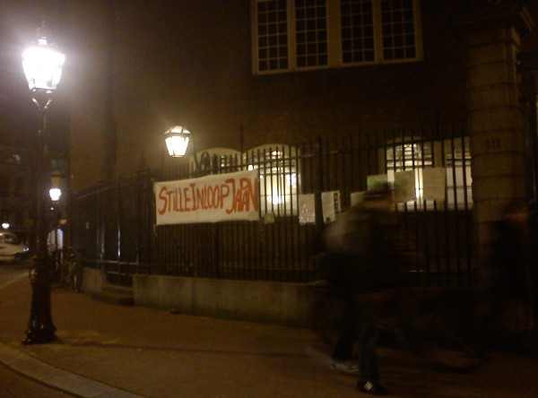

La semaine dernière c'était **la semaine du miracle d'Amsterdam**, une histoire miraculeuse comme on en entend parler ça et là dans le monde. Ce miracle a eu lieu en 1345 dans la maison d'un riche homme habitant Kalverstraat. Peu de temps après, une chapelle a été implantée sur le lieu de ce miracle. Cette dernière attirait les pèlerins de tous pays.

En 1578, alors qu'Amsterdam devient protestante, le culte catholique devient interdit. Dans les faits le culte catholique continue mais de manière cachée, les églises sont secrètes, les cloches ne sonnent plus et les pèlerinages se font sans chants sur la route[^1]. On dit que la procession du miracle a du se transformer en marche silencieuse pour ne pas transgresser la règle.

### De stille Omgang

En 1881, alors que les catholiques retrouvent leur liberté de religion, une procession silencieuse est organisée pour la première fois dans les rues d'Amsterdam. Des milliers de pèlerins y ont participé venant de tous les Pays-Bas. Parce que cette procession est silencieuse elle a attiré encore plus de monde. Aujourd'hui encore les gens viennent du pays entier pour y participer.

L'église de kalverstraat ayant disparue, c'est la paroisse catholique du beguinage qui organise cette marche ([la néerlandaise](http://www.begijnhofamsterdam.nl/), pas [la française](/bonne-fete-pascales)). Elle fait commencer les festivités le mercredi d'avant, avec messe tous les jours (voir le [programme](http://www.begijnhofamsterdam.nl/images/stories/frontpage/2011mirakelweek.jpg)). Le samedi enfin, Un évêque vient faire la célébration qui lance la procession silencieuse. Un petit tour d'une heure dans les rues du centre ville d'Amsterdam.Dans la ville agitée, les pèlerins croisent touristes et fêtards qui occupent les rues animées. Certains égrainent des chapelets et d'autres regardent les vitrines. On discute aussi.

### De stille Inloop

{.center}

La marche silencieuse est si connue parmi les chrétiens de la ville que les protestants aussi organisent la leur. L'[église Luthérienne évangélique](http://www.luthersamsterdam.nl/oudeluthersekerk/index.html) du Spui, à deux pas du béguinage, était aussi ouverte pour la nuit. devant ses grilles une inscription: **StilleInloop Japan**, ce qui veut dire *entrée silencieuse*, en référence à **stille loop** qui sigifie *marche silencieuse*. Le protestants profitent de cette célébration catholique pour consacrer une nuit à la solidarité avec ceux qui ont souffert du dernier tremblement de terre.
---
[^1]: Lire [les catholiques et les protestants](/catholiques-et-protestants)