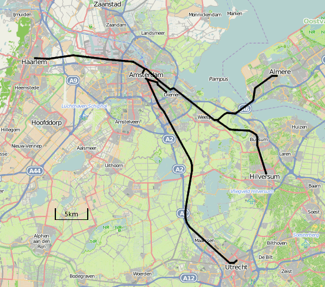
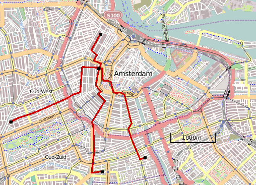

Si vous suiviez mes aventures sur ce blog, vous sauriez sans doute que j'ai [acheté un appartement](/signatures-week) à deux en 2008, juste avant la crise des *subprimes*. Tout serait pour le mieux si la deuxième propriétaire ne s'en était allée. Puisque je ne pouvait assumer seul le [crédit immobilier](/credits-pays-bas), nous avons mis l'appartement en vente. Ce, en vain pendant un an. Il y a maintenant sur le marché de nombreux biens plus intéressants et les acheteurs sont rares. La crise est passée par là.

Nous avons donc décidé, fin 2010, de louer l'appartement. À Amsterdam comme partout ailleurs, la demande est forte en logements. Nous avons rapidement trouvé des locataires. Ces derniers ont demandé à investir les lieux dès que possible ce qui, après acceptation de ma part, ne m'a pas laissé beaucoup de temps pour trouver un nouveau logement.

J'ai donc fait une petite tournée des canapés. Au départ, les propositions venaient d'amis à **Utrecht**, **Haarlem**, **Diemen**, **Almere** ou **Hilversum**. Je vous laisse réaliser sur cette carte le trajet que fait chacun pour venir travailler à Amsterdam.

{.center}

J'ai finalement utilisé l'hospitalité d'habitants d'Amsterdam entre **Herengracht**, **Overtoom** et **le Pijp**. Ceci m'a permis de continuer à aller travailler [à vélo](/drooderfiets-mon-nouveau-velo).

{.center}

Dernièrement, le copain d'un copain m'a fait l'offre d'occuper son appartement dans un quartier au nord-ouest du centre historique. Un bon plan. C'est donc dans ce quartier de **Spaarndamerbuurt** que je vis depuis dimanche.

C'est donc un grand changement pour moi, je redeviens locataire, je vis dans un immeuble de logements sociaux et je suis dans un secteur de la ville que je ne connais pas bien, loin du marché [Albert Cuyp](/albert-cuyp-le-marche). 

Grâce à ce nouvel emplacement, je compte donc vous faire découvrir de nouvelles facettes de moi à Amsterdam.
