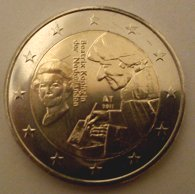

{.right}
Depuis mon annonce de la sortie de la [nouvelle pièce commémorative néerlandaise](http://meinamsterdam.nl/piece-de-2-euros-neerlandaise), j'ai découvert deux sites intéressants. Le premier est *[Ik heb hem](http://www.ikhebhem.nl/)* qui peut se traduire par **«J'en ai une# »**. Sur ce site, les gens pouvaient photographier leur pièce à effigie d?Érasme et peut être gagner un lingot de 100g d'argent massif.

On voit sur la carte que la pièce a bien été distribuée sur tout le territoire national. Le jeu s'est terminé au 1er mars et je n'ai pas pu gagner parce que j'ai perdu mon appareil photo le jour ou je voulais prendre ma pièce en photo. C'est dommage.

J'aurais du m'y prendre à l'avance, cette pièce a été annoncée [le 24 janvier dernier](http://www.knm.nl/Nieuwe-Nederlandse-2-euromunt-geslagen-met-nationaal-thema-Erasmus/nl/news/100/?NieuwsGroepID=1) par la monnaie royale des Pays-Bas (*Koninklijke Nederlandse Munt*).

Le deuxième site est justement celui de la monnaie royale des Pays-Bas. Ce pays est tellement fier de sa première pièce commémorative avec un sujet national que pour la première fois, que certains on décidé de de participer à sa diffusion. Si vous habitez aux Pays-Bas, pas besoin de chercher à recevoir de la monnaie tous les jours dans l'espoir de dégoter cette pièce. Il vous suffit de [la commander chez Nederlandse Munhuis](http://www.muntenhuis.nl/top-5/2-euro-herdenkingsmunten/). Le prix ? Cette commande ne vous coutera que 2 euros. N'hésitez pas.
---