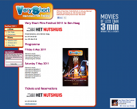

Après presque deux semaines, je romps le silence avec deux billets en deux jours, le deuxième annonçant **deux nouveaux sites web** qui ne se sont pas fait en deux jours. Ces deux sites vous expliquent pourquoi je vais encore être un petit peu occupé dans les jours qui viennent.

## RIPE 62

Le soixante-deuxième **RIPE Meeting** aura lieu à Amterdam comme c'est régulièrement le cas. Mon premier meeting a eu lieu dans cette ville et [je vous ai fait un joli compte rendu](/c-etait-ripe-55-meeting). C'était en 2007 et on avait encore des blocs IPv4 à foison. Trois ans plus tard, les stocks se sont épuisés mais on continue à organiser des conférences. Comme [je suis webmaster au RIPE NCC](/mon-nouveau-boulot-3), c'est un peu mon boulot de lancer le site de **RIPE 62**. Il n'est pas terminé mais j'en suis déjà fier.

<!-- HTML -->

[ripe62.ripe.net](http://ripe62.ripe.net/)

<!-- / HTML -->

Si vous êtes sages, je vous ferais, cette fois encore un compte rendu. En attendant, si la bonne marche de l'Internet vous préoccupe, je vous invite à vous inscrire à RIPE 62 dès maintenant, c'est du 2 au 6 mai.

## 13ème Very Short Film Festival

Comme l'année dernière, à peine le *RIPE meeting* terminé, je vous invite au cinéma pour voir le **festival des très courts** (*Very Short Film Festival 2011*), un festival ou chaque film n'excède pas 3 minutes. Un mélange beau, drôle, émouvant et éclectique qui avait déjà enchanté le public néerlandais [l'année dernière](/festival-des-tres-court-enfin-a-amsterdam).

<!-- HTML -->

 
[veryshort.nl](http://veryshort.nl/)

<!-- / HTML -->

Cette année le festival des très courts aura lieu dans les deux villes d'**Amsterdam** et de **La Haye**. Un développement rendu possible grâce à l'enthousiasme des personnels de la [Nutshuis](http://nutshuis.nl/) à La Haye et du [Kriterion](http://www.kriterion.nl/) à Amsterdam. J'espère vous y retrouver bientôt, juste après le RIPE meeting, dans l'un ou l'autre des deux cinémas.
