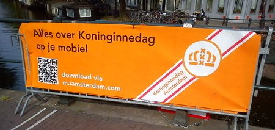
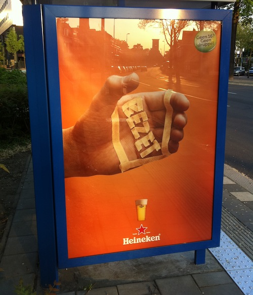

Tous les ans je vous parle de la fête de la reine et de tout le orange qu'il y a autour[^1]. Cette année le manque de temps m'empêche[^2] de m'y attarder mais je voulais quand même signaler une tendance du cru 2011:

**La fête de la reine essaye de devenir de plus en plus mobile**

La tendance se confirme avec les grandes marques néerlandaises qui lancent des campagnes pour mobiles ayant pour thème la fête. En premier lieu, Marktplaats, le site de brocante en ligne qui profite de [ce jour de brocante géant](/nouveau-mot-bezet) pour rappeler que c'est la fête de la reine tous les jours sur son site. Markplats propose à tous les vendeurs de rue de référencer leur stand sur leur nouveau site [vrijmarktplaats](http://www.vrijmarktplaats.nl/)[^3]. Chacun pourra ainsi le retrouver grâce à une carte interactive. Markplaats propose aussi [une App. iphone](http://itunes.apple.com/nl/app/oranjeplaats/id432590730?mt=8) permettant de retrouver son copain dans la foule.

Ce matin, j'ai vu des gens de la mairie installer des banderoles avec des QR codes permettant de retrouver toutes les informations **mobiles** mises à disposition par la ville[^4].

{.center}

Le seule à ne pas croire à cette tendance mobile, c'est Heineken, sa campagne pour le jour en orange montre une main avec un emplacement réservé (*bezet*)[^5] pour un verre de bière. Il ne peut donc pas y avoir de téléphone dans cette main.

{.center}

Je serais plutôt d'accord avec Heineken sur ce coup là. Le jour de la fête de la reine, il y a tellement de monde en ville que les réseaux mobiles sont saturés, il est impossible de passer ses coup de fils ou d'envoyer le moindre SMS. je doute que la moindre app connectée fonctionne correctement.

**Pour la fête de la reine, un conseil, planifiez vos rendez-vous à l'ancienne: en avance**.

Autres billets sur le sujet :
* [Koninginnedag (la fête de la reine)](/koninginnedag)
* [Après koninginnedag](/apres-koninginnedag)
* [Quelques panoramiques](/pas-de-fete-du-travail)
* [La fête de quelle reine ?](/la-fete-de-quelle-reine)
* [Lettre aux copains qui viennent à la fête de la reine](/lettre-aux-copains-qui-viennent-a-la-fete-de-la-reine)
* [La fête de la reine, c'était bien mieux avant](/fete-dela-reine-bien-mieux-avant)

---
[^1]: Vous pouvez faire une recherche avec [koninginnedag](/koninginnedag) sur ce blog pour retrouver tous mes articles
[^2]: [Je vous ai dit](/deux-nouveaux-sites-web) que [RIPE 62](http://ripe62.ripe.net/) et le [Very Short Film Festival](http://veryshort.nl/) me prenait du temps.
[^3]: Construit avec les mots «marché libre» (vrijmarkt) et «place de marché» (marktplaats).
[^4]: Je vous parlais de ce site dans [un long article de 2008](/fete-de-la-reine)
[^5]: Lire [Nouveau mot: Bezet](/nouveau-mot-bezet)