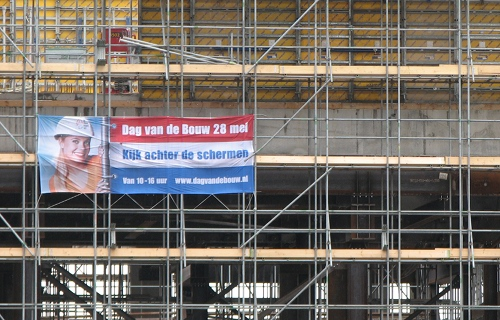

Tous les ans la [fédération néerlandaise du bâtiment](http://www.bouwendnederland.nl/web/pages/default.aspx) organise sa **journée portes ouvertes de la construction**. Cette année, le samedi 28 mai 2011, ce sera la sixième édition. Cette opération de communication est l'occasion rêvée pour découvrir ce qui se passe derrière les palissades de chantier que l'on croise trop souvent en ville.

À Amsterdam, pas moins de 13 sites seront ouvert au public avec visites guidées par les responsables de chantiers. Le projets le plus gros est évidement le plus couru depuis que cette journée existe. C'est bien sûr le chantier de la [Noord Zuidlijn](/la-ligne-du-nord-au-sud) dont j'ai souvent [critiqué les retards](/travaux-n-en-finissent-toujours-pas) et dont l'on pourra visiter de nombreux sites tout le long de la ligne. Il y a aussi des gros chantiers de rénovation qui seront ouverts ainsi que de nouveaux bâtiments. Autre star des visites de cette journée, le Rijksmuseum est aussi un lieu qui bat des records de retard de livraison. La plus grosse partie du musée national du pays est en rénovation depuis 2003 et devrait [rouvrir ses portes en 2013](http://www.rijksmuseum.nl/verbouwing?lang=nl). Il sera possible ce samedi de visiter les salles que l'on ne peut pas visiter en achetant un billet à l'entrée habituelle.

{.center}

Selon le [site de la ville d'Amsterdam](http://www.amsterdam.nl/algemene_onderdelen/indexen/nieuws/dagje_uit_en/@198820/dag-bouw-2011/?utm_source=twitterfeed&utm_medium=twitter), 13 chantiers y ouvrent leur portes:

<!--excerpt-->

* Couverture de la station de bus IJsei, *De Ruyterkade*
* Construction Noord/Zuidlijn à la Gare Centrale, *Amsterdam CS*
* Construction des docks de l'IJ *Westerdoksdijk 10*
* Noord/Zuidlijn: Station de métro Rokin, *Rokin*
* Noord/Zuidlijn: Station de métro Vijzelgracht, *Vijzelgracht*
* Nouveau bâtiment du EYE Film Instituut Nederland, *IJpromenade*
* Noord/Zuidlijn projet Sixhaven, *Sixhavenweg*
* Renovation du pont de Hogesluis, *Amstel 344*
* Restoration du musée Rijksmuseum, *Hobbemastraat 21*
* Noord/Zuidlijn: [Station de métro Ceintuurbaan](/noord-zuidlijn-ceintuurbaan-station), *Ceintuurbaan* (près du [marché Albert Cuyp](/albert-cuyp-le-marche))
* Renovation de la rue Czaar Peter, *Czaar Peterstraat*
* Nouveau bâtiment Miles, *De Boelelaan* ([Zuidas](/un-buurt-nomme-zuidas))
* Site de la route Westrand, *Westpoortweg 20*

Beaucoup d'autres chantiers sont ouverts à la visite à travers tout le pays. Ils sont tous référencés [sur cette carte](http://www.dagvandebouw.nl/projecten-en-locaties/).
