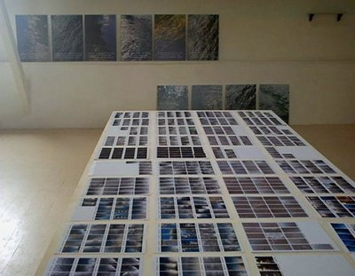
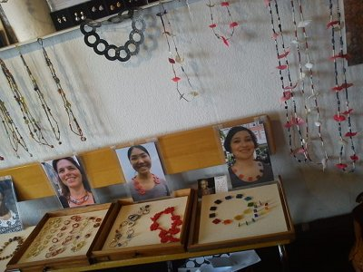
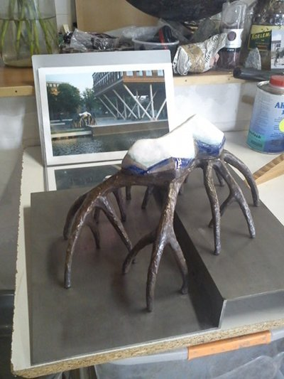
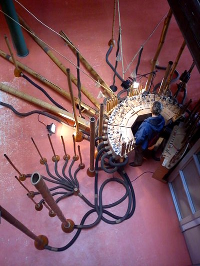
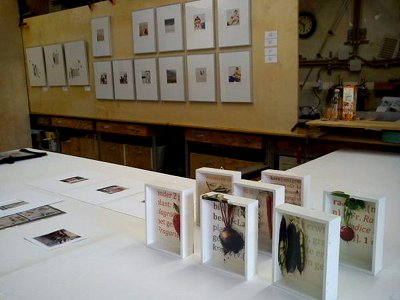
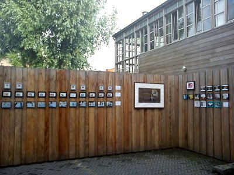

Mon nouveau quartier *Spaardamerbuurt* est à deux pas d'un autre quartier très sympa qui s'appelle *Westelijke Eilanden* (**Les îles de l'ouest**). Et ce week-end, c'était portes ouvertes dans les ateliers de *Westelijke Eilanden*. Une manifestation qui attire les curieux depuis 1971. Je ne pouvais pas la manquer.

Les *Westelijke Eilanden* sont des îles reliées par plusieurs ponts à l'ouest de la gare centrale. Les canaux qui les entourent les isolent du centre et du Jordan qui les bordent et cet isolement leur donne un caractère tranquille qui rend le quartier agréable à sillonner les jours de beaux temps. Les maisons sont pour la plupart des anciens entrepôts des siècles passés, transformés en habitations ou des habitats sociaux des années 80. Ce que l'on voit moins c'est que derrière ces façades, se cachent de nombreux ateliers d'artistes.

Les **Open Ateliers Westelijke Eilanden** ([OAWE](http://www.oawe.nl/)) sont une occasion de voir ces ateliers et de rencontrer des artistes qui sont plus ou moins renommés, sur leur lieu de travail habituel. N'ayant que peu de temps, je n'ai pas tout visité, mais je suis allé au nord dans un bâtiment nommé [Het Veem](http://www.veem.nl/), des hectares d?entrepôts sur 4 étages transformés en espaces pour artistes (film, théâtre, photo, arts plastiques...) Pas moins de 10 artistes étaient présents pour rencontrer le public. En voici un court aperçu.

{.center}

{.center}

{.center}

{.center}

{.center}

{.center}

Pour ceux qui pensent que je n'annonce pas assez à l'avance les évènements, je peux signaler d'autres *open ateliers* les 18 et 19 juin les [Open Atelier Boven 't IJ](http://sites.google.com/site/arouteart/noorder-ij-kunstenaars)
---