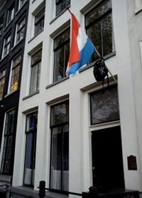
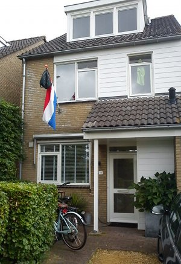

**Un [drapeau Néerlandais](/le-prinsenvlag-aux-fenetres/) et un sac à dos, exposé à l'avant d'une maison sur les canaux d'Amsterdam.**

{.left} C'est une charmante tradition néerlandaise que celle d'accrocher son sac d'école sur une hampe avec [un drapeau des Pays-Bas](/le-prinsenvlag-aux-fenetres). C'est un signe ostentatoire de fin d'année scolaire. C'est le signe que dans cette maison un jeune homme, une jeune fille vient de passer ses examens. Le signe d'achèvement d'un cycle scolaire studieux. La famille célèbre le nouveau diplômé en accrochant un drapeau à la fenêtre. Le diplômé, se libère de sa charge scolaire en accrochant son cartable et ses bouquins d'école au drapeau.

Parfois les drapeaux comportent l'inscription *Geslaard* qui est le participe passé de **réussir**. En France, si on avait à l'écrire sur un drapeau, on mettrait plutôt **reçu(e) à l'examen**.

Généralement le drapeau accroché est en l'honneur d'un adolescent de 16 à 18 ans qui termine ses études secondaires. Ici, les études secondaires commencent à 12 ans, age auquel les jeunes sont orientés en lycée technique (Atheneum) ou général (Gymnasium). Il y a plusieurs diplôme de fin d'étude secondaire en fonction des branches. les jeunes *geslaagd* célèbrent l'obtention de leur **HAVO** ([Hoger algemeen voortgezet onderwijs](http://nl.wikipedia.org/wiki/Hoger_algemeen_voortgezet_onderwijs)), **VMBO** ([Voorbereidend middelbaar beroepsonderwijs](http://nl.wikipedia.org/wiki/Voorbereidend_middelbaar_beroepsonderwijs))ou **VWO** ([Voorbereidend wetenschappelijk onderwijs](http://nl.wikipedia.org/wiki/Voorbereidend_wetenschappelijk_onderwijs))

L'année prochaine ils seront dans une entreprise, peut être en alternance ou à l'université, mais pour l'instant, ils préparent les vacances avec fierté.

{.center}
