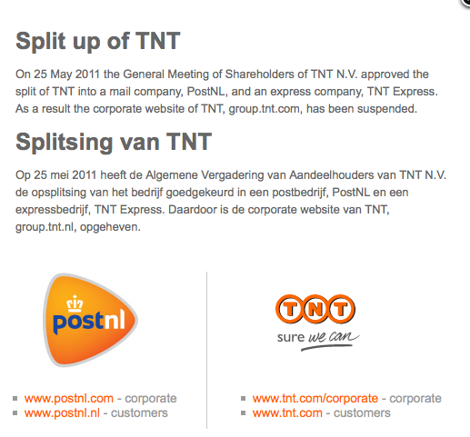

L'évolution récente de la poste néerlandaise n'est pas reluisante. Depuis cinq ans beaucoup de choses ont changé. La poste néerlandaise, privatisée en 1986, a fusionné avec le groupe TNT en 1996 et s'est appellé TPG. En 2006 elle change à nouveau de nom pour [s'appeler TNT Post](/la-poste-prends-les-couleurs-d-halloween). 

C'est la grande période où la poste assume sa sa privatisation et de l'entrée dans le monde de la libre concurrence. Elle entre sur le marché allemand de la distribution du courrier (avec [TNT Post](http://www.tntpost.de/)) et crée une filiale [Sandd](http://www.sandd.nl/page.php?page=1&menu=1) spécialisée dans la distribution de publicités, où le statut de préposé est bien plus précaire que le statut de facteur dans la maison mère. Parallèlement, TNT Post [ferme progressivement ses bureaux de poste](/la-fin-des-bureaux-de-poste) (les derniers en 2008). Fin 2010 l'entreprise annonce devoir licencier 1300 facteurs.[^1] Les facteurs font grève en novembre 2010 mais c'est surtout pour négocier de bonnes conditions de départ.

<!--excerpt-->

{.left}
Après toutes ces aventures, et [l'augmentation répétée du prix du timbre](/timbres-nouvelle-numerotation), il est normal que l'entreprise souffre d'une image défavorable auprès du public. TNT Post devient mème sujet d'études anglaises sur les méfaits de la privatisation. (lire [Privatised mail: a second-class delivery](http://www.guardian.co.uk/uk/2011/apr/29/mail-privatisation-second-class-delivery)). Dans pareils cas, certaines entreprises changent de nom et lancent une campagne pour redorer leur image. Les exemples ne manquent pas en France. C'est aussi ce que TNT Post fait en ce milieu d'année 2011. Il faut maintenant dire **PostNL**. 

Un nouveau logo, plus rond essaye d'arrondir les angles avec la clientèle un peu comme le nouveau logo de la poste française. Le **nl** collé au *post* fait très moderne, il surf sur la vague internet sachant qu'aux Pays-Bas, les [noms de domaine en .nl](/trois-millions-de-domaines) sont très populaires. Le logo est résolument dynamique, il a une forme triangulaire comme une touche *play* sur une page web, il veut aller de l'avant. L'entreprise veut continuer à avancer malgré tous ses déboires passés. Le nouveau slogan va de l'avant aussi. *Morgen is Vandag*, *Tomorrow starts today* Demain commence aujourd'hui. La communication met l'accent sur ce qui fait moderne comme les services de livraison des achats en ligne.

Techniquement c'est n'est pas uniquement un changement de nom, les division courrier et messageries du groupe TNT, anciennement TNT Post et TNT Express, se sont séparées en 2 entreprises différentes. La seconde garde son nom tandis que la première communique en tant que PostNL pour redorer son image. C'est du moins ce que l'on lit sur l'ancien site du groupe TNT.

{.center}

---
[^1]: Officiellement c'est à cause de la baisse de volume du courrier pris en charge par l'entreprise. La crise à bon dos, s'il n'y a plus de bureaux de poste et que l'entreprise fait distribuer la publicité par sa filiale bon marché, il est un peu normal de constater une baisse de volume.
<!-- post notes:
http://www.depers.nl/economie/178838/Laatste-postkantoren-sluiten-deur.html
http://www.ambafrance-nl.org/spip.php?article9368
--->
