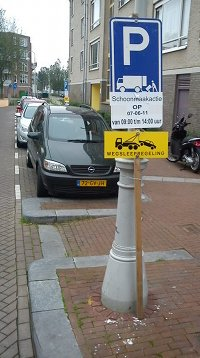

{.left}
La mairie de mon arrondissement a décidé de faire une grande opération de nettoyage (*Schroonmaakactie*) sur la place qui me tient lieu d'adresse pour le moment. Pour cela, les grands moyens vont être employés, il est interdit de se garer et tous les vélos qui sont mal garés seront *éliminés*. Je ne sais pas comment il vont se charger de tout ça.

Les habitants de la place ont reçu un message dans leur boite-aux-lettres indiquant ce grand nettoyage de printemps et cette interdiction de stationner. La lettre en profite pour nous rappeler qu'en temps normal, c'est à chacun de balayer devant sa porte. Étant donné que j'habite dans un immeuble, il est fort probable que chacun pense que la porte d'entrée est gardée propre par un des voisins...

Cette action est peu courante et c'est pour ça que j'en parle. Elle n'est pourtant pas limitée à mon nouvel arrondissement de l'Ouest. Il y a deux ans, dans mon arrondissement du Vieux-Sud une action similaire a été entreprise mais j'étais trop occupé à parler des [marronniers du printemps](/le-retour-du-printemps) pour vous en parler.

Le nettoyage de printemps est une action souvent organisée dans les villes où il neige beaucoup en hiver. On retrouve tout un tas de cochonneries sous la neige quand elle se met à fondre. Ici, il n'y a pas eu de neige en 2011 mais le nettoyage est quand même organisé. En plus il n'intervient qu'au mois de juin. Il vaut mieux tard que jamais.
