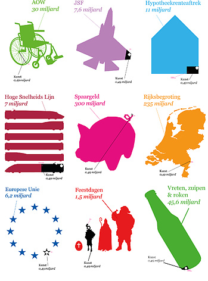
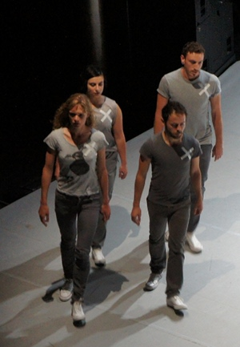

Non ce n'est pas un appel à la reprise du mécénat religieux de la culture. J'avais parlé en octobre dernier, de l'accord de gouvernement qui faisait des [coupes sombres dans le budget de la culture](/culture-en-baisse). L'état a décidé de couper 200 millions d'euros d'aides et subventions pour la culture dans le prochain budget. Certains orchestres philharmoniques vont surement fermer et peut-être que des grands festivals n'auront pas lieu.

Beaucoup de reproches ont été fait à ce sujet au secétaire d'État **Halbe Zijlstra** qui s'est rendu célèbre pour ne pas les écouter. Mêmes des économistes sont montés au créneau lui reprochant [un calendrier trop serré et les coupes trop abruptes||http://www.ambafrance-nl.org/spip.php?article13072#outil_sommaire_3]. Zijlstra ne s'est pas fait des amis dans le monde des arts. En novembre dernier, des centaines de miliers de personnes [ont crié leur mécontentement dans tout le pays](http://www.presseurop.eu/fr/content/news-brief-cover/398431-un-cri-collectif-pour-defendre-la-culture).

La protestation a enflé et comme elle concerne l'art, elle était très créative. Elle s'est crée un logo, une croix blanche sur fond noir, comme pour montrer que le secrétaire d'état décide de faire une croix sur ce qui donne des couleurs au pays. Cette croix fait un carton sur les réseaux sociaux, on peut en voir de nombreux exemplaires sur Facebook (voir copie d'écran ci-dessous)

Il y a aussi [la campagne Mediamatic](http://www.mediamatic.net/page/219535), la galerie multimédia a créé des posters comparant la taille du budget de la culture à quelques autre grandes composantes du budget des Pays-Bas. L'argent de la culture, c'est un paille. Y toucher fait beaucoup de bruit mais ne résoudra pas les problèmes budgétaires du gouvernement.

[{.center}](http://www.mediamatic.net/page/219535)

L'ADFE signale [dans sa lettre](http://www.paysbas.francais-du-monde.adfe.org/articles.php?lng=fr&pg=5521) qu'une marche de 26 km était organisée le 26 juin dernier. Les amoureux de la culture voulait montrer leur mécontentement. Le lendemain, 27 juin, à la Haye,les députés avalisaient les coupes budgétaires alors que les protestations se font entendre dans la rue. Circulez, il n'y a plus rien à voir.

Il est encore trop tôt pour constater les conséquences de ces coupes budgétaires mais une chose est sure, le monde de la culture, les artistes ne vont pas faire campagne pour l'actuel gouvernement. La contestation continue et pas plus tard qu'hier, quelques danseurs au Paradiso portaient la croix blanche sur leurs costumes.

---