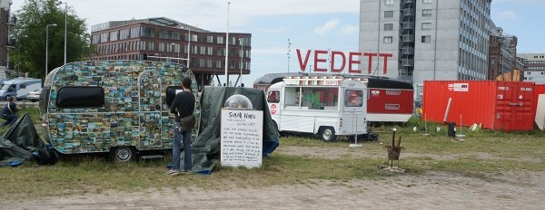
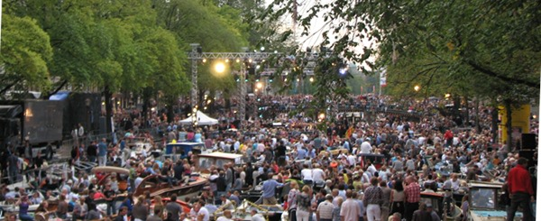

Comme partout en France, Amsterdam est le lieu de nombreux festivals en été en voici une liste non exhaustive pour août 2011.

Amsterdam, première ville touristique des Pays-Bas n'est pas en reste de festivals. Je ne pourrais vous les citer tous mais en voici une petite sélection pour ce mois d'août.

### Du cinéma plein les yeux
Il y a plusieurs propositions à l'agenda, à commencé par [Pluk de Narch](http://www.plukdenacht.nl/) sur ma plage secrète préférée. Pluk de nacht est un cinéma en plein air qui projette souvent des films qu'on ne voit pas en salle, toujours accompagné d'un court métrage et suivit d'une teuf. L'entrée est gratuite mais les chaises longue sont payantes.

{.center}

Un festival plus classique, dans le cinéma art-déco du **Rialto** vous propose une sélection de films d'Afrique, d'Asie et d'Amérique latine: le [World Cinéma Amsterdam](http://www.worldcinemaamsterdam.nl/). Cette année il semble qu'il y a beaucoup de films Bollywood. c'est tendance.

Retour au plein air pour la fin de l'été à l'ouest de la ville. [New Beach Festival](http://www.nieuwwest.amsterdam.nl/vrije_tijd_en_sport/kunst_en_cultuur/artikelen/west-beach/) se tiendra au bord du lac Sloterplas sur la terrasse du **Sloterpark café**.

### Des musiques pour toutes les oreilles
Pour les branché techno, les Pays-Bas ne sont pas trop le pays des teufs secrètes et des technivals. Par contre de gros festival techno et house sont organisés toute l'année. La logistique est nickel et le *line up* est toujours très motivant malgré le prix des billets. Il faut bien payer tous ces DJs connus. Certains de ces festivals sont des institutions comme [Dance Valley](http://www.dancevalley.com/2011/) ou cette année, on [pouvait y croiser le premier ministre](http://www.nrc.nl/nieuws/2011/08/07/video-rutte-waagt-een-dansje-op-dance-valley/).

Le festival techno du mois d'août est [Loveland](http://lovelandfestival.nl/), lui aussi au bord du Sloterplas.

Les amateurs de classique ne sont pas en reste, [Robeco Zomer Concerten](http://www.concertgebouw.nl/robecozomerconcerten) investi le **concertgebouw** pour 87 concerts variés allant de la musique de chambre à la world music. 

Aussi, le jour du loveland festival est aussi le premier jour du **festival des canaux d'Amsterdam** ([Le Grachtenfestival](http://www.grachtenfestival.nl/)) (après [le concert d'ouverture](http://www.at5.nl/artikelen/66737/grachtenfestival-geopend-op-kloveniersburgwal)). Deux semaines ou les ensembles classiques sont programmés pour des concerts à bord de bateaux, dans des parcs ou sur les quais. Le point d'orgue de ce festival est **le concert du Prinsengracht** du 20 août, retransmis à la télé, il attire un monde fou qui sature le canal.

{.center}

Moins couru mais apprécié des amateurs, l'[Internationaal Orgel Festival](http://www.oudekerk.nl/agenda/internationaal-orgel-festival.html) met en valeur l'un des orgues les plus réputé de la ville, celui d'**Ouderkerk**, en invitant des organistes mondialement réputés.

### Le festival des bonnes affaires
Les festivals, qui souvent sont en plein air, ne font pas toujours le plein à cause du mauvais temps. mais il y a d'autres lieux qui font le plein en ces temps humides, ce sont les parc couverts de jeux pour enfants. Ils n'ont pas désempli du mois de juillet rapportait un journal.
---