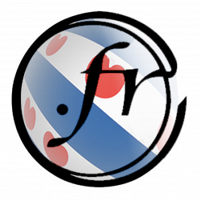

{.left} On pourrait croire que dans un petit pays comme les Pays-Bas les régionalismes ne sont pas très puissants puisque tout le monde habite à maximum trois heures de route de l'autre. [On a vu qu'il n'en était rien](/les-provinces-des-pays-bas).

On pourrait croire aussi que le [succès des noms de domaines en .nl](/trois-millions-de-domaines) avait annihilé les revendications régionales concernant les noms de domaine. Il n'en est rien.

En février dernier, une annonce saugrenue proposait à la frise de se venger de l'invasion française survenue il y a 200 ans en proposant des noms de domaine en .fr à tous les frisons.

David Dijkstra, le directeur du bureau d'enregistrement Hostnet est lui même frison (*hij is een geboren en getogen Fries*) , il a donc lancé un site dédié à cette nouvelle offre: [namme.fr](http://namme.fr/). Le site explique tout en néerlandais mais hélas, pas en frison. À l'époque, [la presse](http://www.depers.nl/opmerkelijk/546189/Friezen-stelen-fr-van-Fransen.html) s'est fait l?écho de l'initiative humoristique.

Il est aussi rappelé que les noms de domaine en **.fr** ne peuvent être attribué qu'en France ou à des français. Depuis 2010, il est possible pour [un français de l'étranger de réserver son .fr](http://www.afnic.fr/fr/l-afnic-en-bref/actualites/actualites-generales/2771/show/le-conseil-d-administration-de-l-afnic-approuve-les-modalites-d-ouverture-du-fr-aux-francais-residents-a-l-etranger.html). Les choses devrait changer bientôt puisque l'AFNIC, registre en charge du **.fr**, prépare [l'ouverture du .fr à l'Europe](http://www.afnic.fr/fr/l-afnic-en-bref/actualites/actualites-generales/2825/show/l-afnic-publie-la-synthese-de-la-consultation-sur-l-ouverture-du-fr-a-l-europe.html) d'ici la fin de l'année.
---
<!-- post notes:
Pour offrir ses services, namme.fr bénéficie donc d'un prête-nom. Mais on ne peut pas savoir [qui c'est|http://www.afnic.fr/outils/whois/namme.fr].
--->
