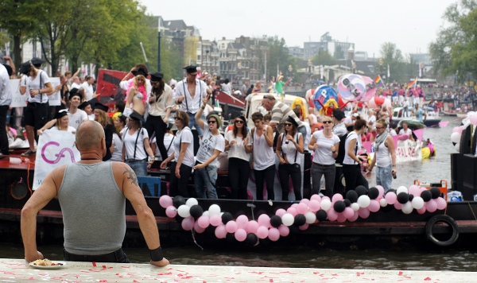
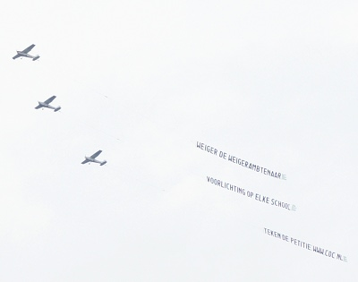

La Gay Pride a eu lieu la semaine dernière, coloriant la bonne ville d'Amsterdam en rose pendant une semaine. Cette semaine des fiertés [LGBT](http://fr.wikipedia.org/wiki/LGBT) attire de nombreux touristes en ville. Les plus visibles sont les gays et lesbiennes venant pour les conférences, expos et autres shows tout au long de la semaine. 

<!--excerpt-->

L'apogée de l'évènement est bien évidemment la parade du samedi, sur les canaux comme il se doit. Cette parade attire une nouvelle foule de touristes, moins gay mais plus nombreuse. De jeunes touristes venant de partout en Europe et surtout de nombreuses familles *white trash* venant en ville pour faire la fête. La gay parade n'est rien d'autre qu'un carnaval supplémentaire qui secoue la ville le temps d'un après midi. Cette année, la fréquentation est en hausse [annonce le Volkskrant](http://www.volkskrant.nl/vk/nl/2686/Binnenland/article/detail/2840007/2011/08/06/Grachtenparade-drukker-bezocht-dan-vorig-jaar.dhtml). Plus que 2010 avec ses 380.000 visiteurs mais pas encore assez pour battre des records. Quand on voit la fréquentation, il n'est pas étonnant que chaque parti, chaque entreprise veut avoir son bateau bien sponsorisé durant la parade. Beaucoup de grandes entreprises d'Amsterdam ont des clubs gay et lesbien dont un comité organise la participation à la parade. Comité qui veille un peu aussi à la bonne intégration des  gouines et des pédés au sein de l'entreprise. C'est aussi le cas dans les entreprises publiques. Les sociétés de transports, l'université, la police et les pompiers ont eux aussi leurs bateaux, tout comme les fonctionnaires de la ville qui ouvrent la parade sur le bateau **Amsterdam** flaqué du maire et d'une [amsterdammertje](http://www.flickr.com/photos/13274211@N00/2111432688/) géante.

{.center}

Cette année, j'ai eu l'impression que les décorations et les costumes étaient moins extravagants que les années précédentes. Moins chers surtout. Peut être qu'en ces temps de crise, le financement des bateaux s'en est trouvé affecté. Qu'importe le défilé à eu lieu, tous étant présents, suivant le slogan de la semaine des fiertés: **We are**. 

{.right}
L'attention moindre sur le décorum de la fête à peut-être fait resurgir le coté revendicatif des débuts. Cette année, [le COC](http://fr.wikipedia.org/wiki/COC_Nederland), association néerlandaise pour l'intégration des homos, [a interpelé](http://www.telegraaf.nl/binnenland/10321580/__COC-voorzitter_tevreden_over_actie**.html?sn=binnenland,buitenland) **Marja van Bijsterveldt**, la ministre de l'émancipation par le biais de banderoles sur les canaux et dans le ciel. Il se trouve que la ministre était justement sur un bateau dans la parade[^1]. Le COC reproche à la ministre Chrétienne démocrate de ne pas soutenir le mouvement autant qu'elle veut bien le montrer. Son parti (le CDA) a soutenu publiquement les fonctionnaires de mairie refusant de marier les couples de même sexe (des objecteurs de conscience) alors que le *mariage gay* est légal. Surtout, son ministère étant aussi en charge de l'éducation, il est demandé à la ministre d'arrêter de s'opposer à ce que des intervenant viennent parler d'homosexualité à l'école. Le COC a appelé à signer [une pétition en ligne](http://petities.nl/petitie/voorlichting-over-homoseksualiteit-op-elke-school) à ce sujet.

Voir aussi: [Amsterdam, capitale gay](/Amsterdam-capitale-gay)

---
[^1]: Aux Pays-Bas, c'est politiquement rentable de se montrer à la *Gay Pride* un peu comme les festivals de l'été, en France, où certains hommes politiques font des apparitions remarquées, ou le salon de l'agriculture.