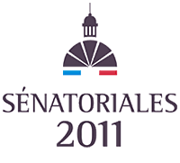

Dimanche 25 Septembre auront lieu les élections sénatoriales. Ce scrutin n'est pas ouvert à tous et c'est pour ça que tout le monde s'en fout. Il n'y aura pas de grande soirée électorale sur TF1 avec plein de débats super fades et fascinants.

Il faut dire que le mode de scrutin n'incite pas à la médiatisation. Seul la moitié de la haute assemblée est renouvelée. Il est donc peu probable qu'un scrutin change drastiquement la composition de la chambre haute. Les sénateurs n'étant pas élus au suffrage universel direct, seuls de rares grands électeurs (députés, conseillers généraux et régionaux, représentants municipaux) sont convoqués aux urnes ce dimanche. Le candidat en lice n'a donc pas à convaincre les foules mais à travailler ses réseaux politiques et répondre au clientélisme local. Tout cela n'encourage donc pas la surenchère médiatique.

Cette retenue médiatique est bien dommage car le rôle d'un sénateur est aussi important que celui d'un député. La couverture médiatique devrait être aussi grande que pour les législatives[^1].

{.left}
Jusqu'à récemment, les élections sénatoriales avaient un écho différent à l'étranger du fait que les seuls représentant des français à l'étranger au parlement sont les [12 sénateurs](http://www.expatries.senat.fr/12senateurs.html) élus par l'[Assemblée des Français de l'Etranger](http://www.assemblee-afe.fr/-qui-sommes-nous-.html). Cette exception ne va pas durer parce que depuis la [loi constitutionnelle du 23 juillet 2008](http://www.legifrance.gouv.fr/affichTexte.do?cidTexte=JORFTEXT000019237256), les français de l'étranger pourront élire leur députés dès les prochaines législatives.[^2]

Pour le moment seul 12 sénateurs me représentent. Le Sénat français étant maintenant renouvelé de moitié tous les trois ans, six sièges sont à pourvoir. [Le conseiller de ma circonscription](/resultat-des-elections) présente les quatre [listes en lice](http://www.un-monde-en-partage.com/?p=1447) pour ce scrutin proportionnel. 

J'allais conclure par un « faites votre choix et faites le bon » mais hélas le scrutin est indirect.
---
[^1]: Comme si la couverture médiatique d'une élection était proportionnelle à son enjeu... les journalistes préfèrent montrer les querelles de personnes et de petites phrases assassines que les vrais enjeux.
[^2]: En juin 2012, sauf accident.