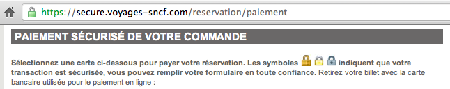
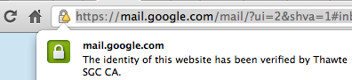

Lorsque que vous surfez sur Internet vous devez parfois transmettre des informations sensibles. Dans ce cas, il est conseillé de surveiller que dans son navigateur, le petit cadenas est bien fermé. Ce cadenas indique que les données envoyées par le site sont chiffrées avec une clé. La clé de déchiffrage est chargé dans le navigateur est il est possible de vérifier si elle est bien émise par le site en question.

{.center}

<!--excerpt-->

Pour automatiser cette tâche de vérification, les clés sont signées par des tiers de confiance. Des sociétés qui émettent des certificats attestant l'origine de la clé qui est chargée dans le navigateur. Les principales autorités de certification sont connues des navigateurs qui acceptent alors la clé automatiquement et peuvent ainsi assurer que la navigation est chiffrée par le bon émetteur.

{.center}

Si une personne malveillante arrive a espionner vos échanges avec un site, elle ne pourra pas prétendre être le site en question parce que sa clé ne sera pas signée par l'autorité de certification.

La communication sur le web est donc sécurisée par des sociétés qu'on appelle **autorités de certification**. Elles vérifient les détails de leurs clients avant de les certifier (et de les facturer). Les certificats sont ensuite gérés avec soin et renouvelé (et facturés) en général tous les ans. Ces  autorités de certification sont aussi appelés **tiers de confiance** parce que bien que ne participant pas à l'échange de données entre le surfeur et le site web, elle intervient pour assurer que cet échange ait lieu en toute confiance.

Hélas le tiers de confiance, n'assure pas toujours la confiance qu'il est sensé garantir. C'est ce qui est arrivé récemment aux Pays-Bas

Tout a commencé le 29 août quand il a été découvert qu'un [faux certificat de google.com](http://www.google.com/hostednews/afp/article/ALeqM5hg3bg9FbZ-AcSAgpmE-1deGgQitg?docId=CNG.3064197b18373026040b9c81ca21df0a.2a1) permettait au gouvernement iranien d'espionner le courrier électronique de ses ressortissants. Le certificat avait été émis le 10 juillet 2011 par Diginotar, société bassée à Beverwijk, qui n'a apparemment pas vérifié l’identité du demandeur pour délivrer ce certificat de google.com.

Le 5 septembre, [on apprenait que cette affaire était plus grave](http://www.securityvibes.fr/menaces-alertes/diginotar-attaque-certificats/) que prévue, Diginotar a été piraté et plusieurs centaines de certificats ont été émis à son insu. Parmi ceux-ci, les certificats organisant la certification des sites gouvernementaux et le chiffrement des données personnelles des citoyens. Le site de l'année 2010, [DigID](http://www.digid.nl/) a du rapidement [mettre à jour ses certificats](http://www.volkskrant.nl/vk/nl/2664/Nieuws/article/detail/2892151/2011/09/05/DigiD-weer-veilig-te-gebruiken-Diginotar-werkte-zelf-volstrekt-onveilig.dhtml) tandis que le service gouvernemental [Logius](http://www.logius.nl/), chargé du projet de e-gouvernement [tente d'expliquer le problème](http://www.rijksoverheid.nl/nieuws/2011/09/06/nieuwsoverzicht-diginotar-problematiek.html) à la population inquiète.

Ce n'est pas la première autorité de certification à se faire pirater mais la durée pendant laquelle Diginotar a été compromise étonne. Le gouvernement reproche à cette compagnie de ne pas avoir installé d'antivirus sur les ordinateurs de leurs employés et autres négligences indignes d'un tiers de confiance. [Dascritch va plus loin et explique](http://dascritch.net/post/2011/09/15/SSL-est-elle) que le business modèle empèche d'avoir vraiment confiance. Les éditeurs de navigateurs ont tous mis à jour leurs produits pour qu'ils n'acceptent plus les clés certifiées par Diginotar. Certains travaillent à mettre des parades au cas où une autre autorité de certification serait corrompue. Essayer de réintroduire la confiance. Pour Diginotar, c'est trop tard...

<!-- post notes:
http://www.clubic.com/antivirus-securite-informatique/actualite-445032-affaire-diginotar-nouvel-editeur-certificats-temporairement.html 

http://dascritch.net/post/2011/09/15/SSL-est-elle 
http://www.vasco.com/company/press_room/news_archive/2011/news_diginotar_reports_security_incident.aspx
--->
