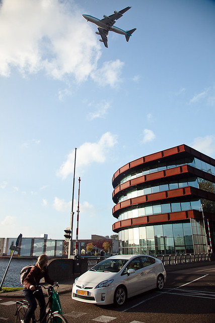
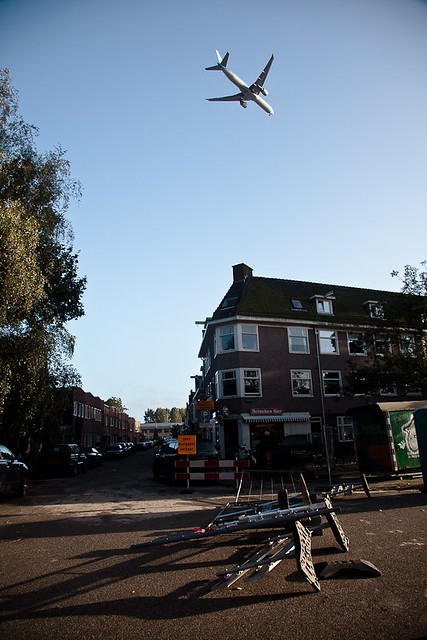
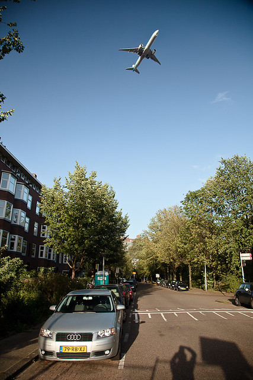

Les Pays-Bas s'appellent comme ça parce que tout est bas. Même le vol des avions. Hier le vent d'ouest était si fort que les avions à l'approche de l'aéroport de [Schiphol](/?q=schiphol) devaient survoler la ville à basse altitude avant d'atterrir. Impressionnant ! Un collègue a pris ces photos hier, voyez plutôt :

<!--excerpt-->

[{.center}](https://www.flickr.com/photos/pmilani/6142063332/in/photostream/)

[{.center}](https://www.flickr.com/photos/pmilani/6142062702/in/photostream/)

[{.center}](https://www.flickr.com/photos/pmilani/6142062094/in/photostream/)

Le son est impressionnant aussi mais je ne peux pas vous l'imposer sur ce blog non sonore.

Le vent [affecte aussi les vélos](/le-temps-de-gate)

*Merci à Paolo pour les photos.*
