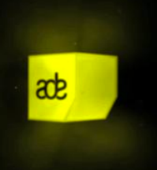

{.left}
Cette semaine c'est l'**Amsterdam Dance Event** un festival de musiques électronique tellement populaire qu'on ne peut pas le rater. En 16 ans, l'[ADE](http://www.amsterdam-dance-event.nl/) est devenu une institution. Les conférences et des ateliers sont courues par un grand nombre de congressistes venus du monde entier et que l'on croise en ville avec leurs badges jaunes.

Le soir, la dance offre ce qu'elle a de mieux au public dans des dizaines de lieux à travers toute la ville. Tous les grands viennent jouer au moins à une des soirées de l'ADE. On a l’embarras du choix. Pour vous faire une idée du programme, je vais vous orienter vers le portail du forum. L'article sur [Amsterdam Dance Event 2011](http://leforum.nl/index.php/events-section/38-evenements/291-amsterdam-dance-event-2011) offre une belle sectionnelle de ce qui vous attend.
---