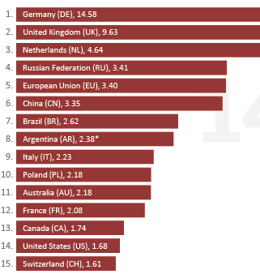

L'association du CENTR, regroupant de nombreux registres de ccTLD, vient de faire paraitre [son rapport](https://www.centr.org/main/6513-CTR/version/6/part/12/data/DomainWire%20Stat%20Report%20(Autumn%202011).pdf?branch=main&language=default) *DomainWire Stat Report*, un rapport succin de statistiques sur ces domaines de premier niveaux correspondants aux code de pays. Pour rester fidèle à mon blog je vais continuer à comparer la France et les Pays-Bas, deux pays très proches et très différents.

Sur le premier graphique, tout va bien, La France et les Pays-Bas font partie du groupe de tête. les 20 premiers ccTLD représentent 75% du nombre de noms de domaine en code pays. La France à la 12ème position se défend bien étant dans le groupe des ccTLD qui ont plus que 2 millions de domaines. Les Pays-Bas se portent encore mieux, à la troisième place, ils dépassent les 4 millions de domaines[^1]. **Il y a beaucoup plus de .nl que de .fr**.

{.center}

<!--excerpt-->

Le score des Pays-Bas dépasse celui de la France de plus du double. C'est pas mal pour un pays qui ne la ramène ni au G20 ni au conseil de sécurité et dont la population est presque 4 fois moindre que la France. La carte ci-dessous, extraite du rapport précité montre ce décalage flagrant entre les quelques pays de tête et les suivants.

{.center}

L'Allemagne, le Royaume-Uni, les Pays-Bas, le Danemark et la Suisse ont tous plus de 15 nom de domaine dans leur extension nationale par tranche de 10 habitants. La France plafonne à 3 noms de domaine pour 100 habitants (en comptant large). La France et le Royaume-Uni sont des pays comparables en terme de population, de croissance et d'économie et pourtant la perfide Albion fait presque 5 fois mieux pour garder ses noms de domaine à la maison. 

Comment cela se peut-il ? **L'internet français est-il à la traine ?**

---
[^1]: Le cap des [3 millions de noms de domaine](/trois-millions-de-domaines) ont été passés en 2008