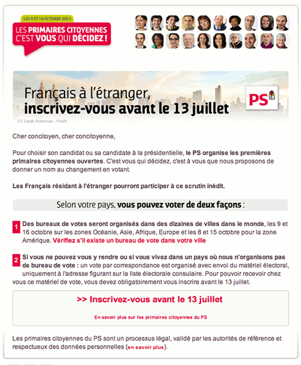

Les primaires présidentielles socialistes de 2011 ([primaires citoyennes](http://www.lesprimairescitoyennes.fr))[^1] organisées par le PS en France a réussi à placer ce parti sur le devant de la scène médiatique pendant plusieurs semaines. L'exercice était difficile parce que le parti prenait le risque d'afficher au grand jours ses divisions et surtout ses inévitables querelles de pouvoir. Le vainqueur des primaires [en sortirait affaiblit](http://www.monde-diplomatique.fr/carnet/2010-12-06-Primaires-PS) tandis que l'autre camp a tout le temps d'aiguiser ses couteaux.

<!--excerpt-->

Le succès des débats télévisés sur **France 2**, puis **I-Télé** et enfin **BFM** ont montré des candidats affirmant leurs convictions mais sans réellement se déchirer. Quelque soit le candidat victorieux au soir du 16 octobre, il aura à porter le programme socialiste, qu'il teintera de sa sensibilité et de sa personnalité. Car au fond, c'est ce que les électeurs auront à choisir: la personnalité du candidat socialiste (et radical de gauche). 

Mais pourquoi je vous bassine avec les primaires qui ont lieu dans un autre pays que le mien ? Simplement parce que j'ai été invité à y participer. Tous français établit hors de France, s'il est inscrit sur les listes électorales, à le droit de voter pour ces primaires. J'ai été invité à m'inscrire par un tract reçu au moins de juin dans ma boite email.

{.center}

Ce tract m'est parvenu parce que je suis inscrit sur les listes électorales [au consulat d'Amsterdam](/carte-inutile). Les partis politiques ayant accès au fichier des électeurs ont put envoyer ce tract à tous les inscrit de ma circonscription pour les inciter à s'inscrire. Je ne sais pas si beaucoup de gens se sont inscrits mais les primaires auront lieux aussi aux Pays-Bas. Le bureau de vote sera installé [à la Haye](http://bureauxdevote.lesprimairescitoyennes.fr/bvpe/BVPC4HAY) dans les locaux du PvdA, le parti travailliste local[^2].

---
[^1]: Ces primaires ne sont pas à proprement parler des élections. On devrait plutôt parler de votation, mais je préfère garder le titre de ma série **Bientôt les élections**.
[^2]: Et vous, vous allez voter où?
<!-- post notes:
http://www.monde-diplomatique.fr/carnet/2010-12-06-Primaires-PS
http://www.france-info.com/france-presidentielle-2012-2011-10-05-primaire-ps-dernier-debat-tele-avant-le-premier-tour-566620-9-508.html
--->
