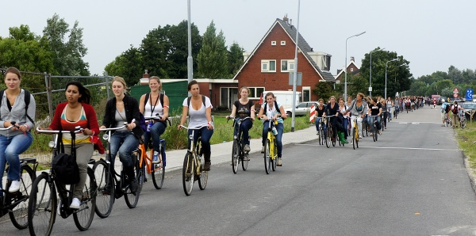
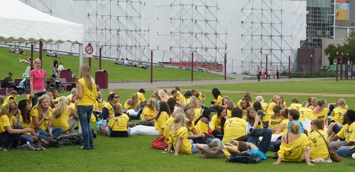

En développant mes films photo, j'ai redécouvert des clichés pris à la fin du mois d'aout et que je voulais partager ici. Il s'agit de ces activités proposées aux nouveaux étudiants pour les intégrer. Je vous ai déjà parlé de ces [sorties d'intégration à la rentrée 2008](/la-rentree-a-amsterdam) en ne vous montrant qu'une photo d'un groupe (peut-être une équipe sportive) dans un bateau. Je veux vous montrer maintenant les troupeaux d'étudiantes que j'ai croisé en août.

Cette interminable file de vélos descendant vers **Aalsmeer** avait tout pour surprendre à la mi-aout. Mais en bon lecteur de mon blog, je me suis souvenu de cette semaine d'intégration (*intreeweek*) et je savais que cet été, la rentrée avait lieu tôt.

{.center}

Quelques jours plus tard, un troupeau de t-shirts jaunes occupait les pelouses de **Museumplein**. J'ai un peu regardé, les meufs avaient l'air d'attendre en écoutant des t-shirt bleus leur dire des choses.
{.center}

Maintenant, nous sommes en octobre et les étudiantes se sont enfin mises à travailler.
