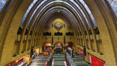

En janvier dernier, j'ai parlé de ce qui sera peut être [le dernier bureau de poste](/Le-dernier-bureau-de-poste) encore en place. En fait j'avais une vision bien amstelodamoise de l'histoire. Il restait encore bien des bureaux de poste dans le pays et il restait même un bureau de poste central (*hoofdpostkantoor*) historique dans la ville d'**Utrecht**. Ce n'est plus le cas aujourd'hui, ce bureau vient de fermer ses portes. Le bâtiment, classé monument historique, ne verra plus passer les sacs de courrier.

De nombreux commentaires indiquent que ce n'est pas uniquement le dernier des bureaux de poste des Pays-Bas mais c'est aussi le plus beau. Le bâtiment est un exemple monumental de l'école d'Amsterdam[^1] en plein centre d'Utrecht, sur la *Neude*.

La construction du Hoofdpostkantoor d'Utrecht a commencé en 1919 pour se finir en 1924. Son architecte **Joseph Crouwel**, est un grand nom de l'école d'Amsterdam, ayant fait ses armes avec **Karel de Bazel** et **Hendrik Petrus Berlage**. C'est peut-être par ce bureau de poste central d'Utrecht que Joseph Crouwel est connu mais il a aussi réalisé d'autres bureaux de poste dans le Pays comme à Haarlem et Bussum. La taille de la façade avant avec ces grandes baies vitrées  le rend impressionnant pour un bâtiment de cette époque mais beaucoup moins aujourd'hui à l'age des tours de cristal. C'est surtout l'intérieur, notamment la grande voûte ovale, marque de fabrique de Joseph Crouwel, qui rend ce bureau de poste si impressionnant. Le tout est souligné par des statues et ornements en pierre bleue par **Hendrik van den Eijnde**, dont une déesse Europe très masculine et taillée à la serpe. L'arrière du bâtiment est plus caractéristique de l'architecte avec ses tours ovales aux minces baies vitrées. Si vous passez par là n’hésitez pas à faire le tour.

[{.center}](https://commons.wikimedia.org/wiki/File:Europa_P1080456.JPG)
> Statue `Europa´ du bureau de poste central d'Utrecht, Hendrik van den Eijnde. Photo: Pieter Deurne (GFDL)

Beaucoup ont dû regretter la fermeture au public de ce bâtiment classé mais la [TNT Post](/la-poste-prends-les-couleurs-d-halloween) avait [annoncé de longue date](/la-fin-des-bureaux-de-poste) ses bureaux de poste allaient disparaître et que les gens iraient [acheter leurs timbres](/tag/timbres) dans les supermarchés. Voici donc **la fin du dernier bureau de poste**.

Pour contenter ceux qui regrettent de ne pas avoir pu visiter ce bâtiment historique avant, un site danois a mis en ligne **un panorama à 360 degrés de ce hall impressionnant**, Vous pouvez donc faire le tour des comptoirs vides du dernier bureau de poste, directement chez vous, en plein écran.

[{.center}](http://www.panoramas.dk/2011/utrecht-post-office.html)
> Cliquez donc sur l'image pour en voir plus.
---
[^1]: [École (mouvement) d'architecture](/l-ecole-d-amsterdam) dont j'ai déjà parlé en donnant surtout des exemples d'Amsterdam.
<!-- post notes:
http://weblab.ab-c.nl/postkantoor
http://www.panoramas.dk/2011/utrecht-post-office.html 
http://nl.wikipedia.org/wiki/Hoofdpostkantoor_%28Utrecht%29 
http://www.duic.nl/nieuws/postkantoor-neude-sluit-eind-oktober-deuren/
--->
