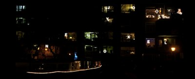

Avec mon nouvel emploi du temps, je suis pris par le temps et dans mon nouvel appartement je suis surpris par les déco de Noël. Comme dans les campagnes, il y a de plus en plus de lumières qui décorent les fenêtres en cette saison. Voilà qui inspire mes vœux saisoniers

[{.center}](http://alix.guillard.fr/voeux/2011/joyeux-noel.html)

Je vous invite à cliquer sur l'image ci-dessus pour voir mes voeux en plus grand et aussi à relire les histoires de saison.

[Joyeux Noël 2010](/joyeux-noel-2010)  
[Saint Nicolas ne concurence pas Noël](/saint-nicolas-ne-concurence-pas-noel)  
[Joyeux Noël 2009](/joyeux-noel-2009)  
[Cette année les vitrines de noël sont sexy](/vitrines-de-noel-sexy)  
[Joyeux Noël 2008](/joyeux-noel-2008)  
[La messe de Noël en français](/la-messe-de-noel-en-francais)  
[Ma carte de 2007](http://alix.guillard.fr/voeux/2007/joyeux-noel.php)  
[La chanson de Noël de 2006](/chanson-de-noel)  
[Joyeux Noël 2006](/meilleurs-voeux-pour-noel)  
[Douce nuit, Sainte nuit / Stille nacht, Heilige nacht](/douce-nuit-sainte-nuit-stille-nacht-heilige-nacht)  
[Les Noël des Pays-Bas](/noel-des-pays-bas)  
[Dweede kerstmis is boxing day ?](/dweede-kerstmis-is-boxing-day)  
[La tradition des vœux en 2008](/pour-les-voeux-c-est-fini)  
[Nouveau mot : Kerstpakket (cadeau de noël)](/dweede-kerstmis-is-boxing-day)  
[Les inondations de Noël](/les-inondations-de-noel)  
[Les maronniers de l'hiver](/les-marronniers-de-l-hiver)  
[La fin des sapins](/la-fin-des-sapins)  
---