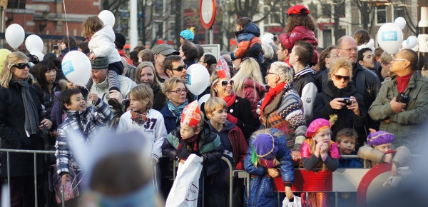
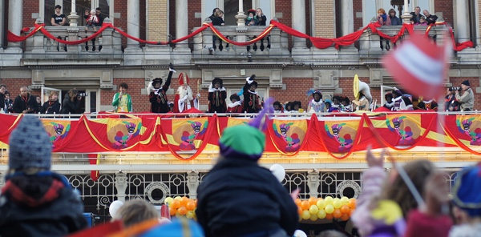

Je vous ai parlé à maintes reprises de *Sinterklaas*, le Saint-Nicolas Néerlandais. Le vrai ami des enfants puisque c'est lui qui leur apporte les cadeaux de fin d'année.

Après toutes ces années à parler de [ce grand barbu](/sinterklaas-est-arrive) sur son cheval, je me suis dit que je me devais d'aller le voir. Je suis donc allé à Amsterdam ou il avait prévu de faire sa tournée en ville avant la distribution des cadeaux du 5 décembre. En fait *Sinterklaas* fait la tournée de toutes les villes des Pays-Bas en deux ou trois weekend. Il est donc facile de ne pas le rater.

{.center}

<!--excerpt-->

{.center}

C'était la fête et il y avait plein de musique et de sponsors, le plus drôle étant que les chansons de Saint Nicolas étaient chantés par les adultes plus que par les enfants. J'imagine que les enfants sont trop concentrés à apprendre les paroles pour quand ils seront parents.

## Le passage à tabac des anti Sinterklaas

Cette année, j'ai aussi découvert des gens qui n'aimaient pas cette fête et le faisait savoir. Ils disent que c'est la faute aux *Piets noirs*[^1] qu'[ils jugent racistes](http://zwartepietisracisme.tumblr.com/). Pas les Piet eux même mais leur présence façon black face idote aux coté du grand barbu.

Donc ils n'aiment pas et ils ont décidé de le dire et d'en faire campagne. Évidement quand on fait campagne contre la discrimination positive à l'embauche pratiquée par le meilleur ami des enfants, on ne fait pas partie des meilleurs amis de la société. La police est heureusement là pour le rappeler à ces trouble-fête.

<!-- HTML -->

<iframe width="560" height="315" src="https://www.youtube.com/embed/p75Kb_RgByY?si=WccjfJTGekYSAI7z" title="YouTube video player" frameborder="0" allow="accelerometer; autoplay; clipboard-write; encrypted-media; gyroscope; picture-in-picture; web-share" referrerpolicy="strict-origin-when-cross-origin" allowfullscreen></iframe>
<!-- Gone <iframe width="560" height="315" src="https://www.youtube.com/embed/9WqSS_O1MkM" frameborder="0" allowfullscreen></iframe> -->

<!-- / HTML -->

----
[^1]: La description de cette tradition saugrenue des *[Zwarte Pieten](/qui-est-tu-zwarte-piet)* avait provoqué plein de commentaires mais pas beaucoup de commentaires racistes. 