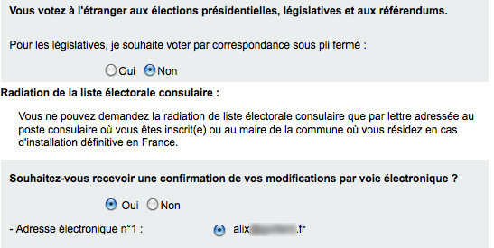
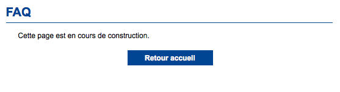

La mois dernier, je vous ai parlé des élections présidentielles de 2012 et des législatives qui auront lieu pour la première fois pour les français de l'étranger. Je vous ai indiqué, comme beaucoup de campagnes vous y incite, à aller vous inscrire sur les listes électorales avant le 31 décembre 2011[^1]. 

Les consulat de France à l'étranger ayant le rôle de mairie pour les expatriés, c'est dans ce lieux que les inscriptions se font pour moi et pour tous mes compatriotes établis hors de l'hexagone. Le ministère des affaires étrangères a bien fait les choses en rendant possible cette formalité en ligne. Le site [monconsulat.gouv.fr](https://monconsulat.diplomatie.gouv.fr/monconsulat/dyn/public/headerPublic/introduction.html) vient d'ouvrir [en grande pompe](http://www.diplomatie.gouv.fr/fr/ministere_817/ministre-etat-les-ministres_818/edouard-courtial_21217/discours_21219/discours-du-secretaire-etat-charge-francais-etranger-lors-assemblee-francais-etranger-30.09.11_95620.html) et à toute vitesse pour permettre à ceux qui sont déjà connus du consulat de faire cette formalité à distance.

<!--excerpt-->

C'est ce que j'ai fait hier, muni de mon numéro NUMIC, j'ai demandé un mot de passe et je me suis connecté au nouveau site **monconsulat**. Pour l'instant, je ne peux pas faire grand chose sur ce site. Je peux juste mettre à jour mon adresse et mon inscription sur les listes électorales. C'est déjà très pratique, je n'ai pas à faire la queue pour pouvoir participer aux élections.

{.center}

Maintenant, si je veux renouveler mon passeport, demander un certificat de vie ou demander une bourse scolaire, le site ne propose pas encore ce service ni aucun des nombreux services déjà disponibles sur [monservicepublic.fr](http://monservicepublic.fr/). La FAQ n'est d'ailleurs pas très loquace quand à la disponibilité future de ces services. J'espère que cette page sera renseignée prochainement.

{.center}

Ceux qui ne se sont pas inscrit au consulat vont devoir se déplacer pour recevoir leur [carte inutile](/carte-inutile) et leur numéro **NUMIC**[^2]. à partir de cet identifiant il pourront je l'espère éviter tout déplacement futur grâce à ce nouveau site.

---
[^1]: Une [loi stupide](http://www.legifrance.gouv.fr/affichCodeArticle.do;jsessionid=980D6B2001938A1D4A0E53ABA489D66B.tpdjo07v_3?cidTexte=LEGITEXT000006070239&idArticle=LEGIARTI000006353035&dateTexte=20111212&categorieLien=cid#LEGIARTI000006353035) bloque les inscriptions plusieurs mois avant le déroulement du scrutin.
[^2]: Je conseille à tout français des Pays-Bas de le faire et de s'inscrire par la même occasion sur les listes électorales. **Le 30 décembre au soir, le consulat général d'Amsterdam fermera et il sera trop tard.**