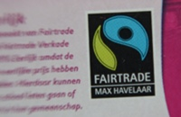
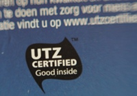

{.left} Les fabricants de chocolat ont presque tous embrassé le commerce équitable pour leurs [lettres en chocolat](/les-lettres-en-chocolat). **Véritable tradition néerlandaise pour les fêtes de la Saint-Nicolas**[^1], les lettres en chocolat ont été l'enjeu il y a quelques années de combats symboliques pour attirer l'attention des consommateurs sur leurs choix et sur le commerce équitable. L'opération s'appelait [le Saint Nicolas vert](/saint-nicolas-vert).

Cette année encore, la campagne continue[^2] mais on peut déjà constater les progrès faits dans la grande distribution. Dans de nombreuses enseignes l'ensemble des lettres en chocolat sont vendus avec un label équitable ou durable (*duurzaam*). Il y a même un site en ligne qui ne vend que des ses lettres en chocolat équitables ([fairtradechocoladeletters.nl](http://www.fairtradechocoladeletters.nl/)).

{.right} Il y a deux labels reconnaissables, le fameux label **Fairtrade** né au Pays-Bas sous le nom "**Max Havelaar**" et le label **UTZ Certified**. Ces  labels sont tous les deux nés d'initiatives privées certifiant le café vendu en occident comme respectueux du niveaux de vie des producteurs et de l'environnement[^3]. Le cahier des charges des deux labels sont équivalents, ils exigent une traçabilité des produits du producteur en bout de chaine de transformation. Ils exigent un bon niveau de gestion de l'exploitation agricole, une gestion durable de l’environnement et surtout une rémunération et une protection (sociale) des producteurs leur permettant de vivre convenablement.

## Pourquoi donc deux labels ?

Pourquoi donc deux labels me direz-vous s'ils certifient la même chose pour les mêmes produits. Il existe en fait une différence de taille entre **Fairtrade** et **UTZ Certified**. 

- Le premier, géré par l'organisme FLO, fixe les prix de vente des produits agricoles pour assurer la bonne rémunération des producteurs. 
- Le second ne veux pas fixer de prix mais se cantonne à vérifier le bon niveau de vie et de protection sociale des producteurs. 

Les deux systèmes ont leurs promoteurs et leurs détracteurs. Certains reprochent à FLO de faire preuve de paternalisme en imposant depuis l'Europe un niveau de prix et un mode de gestion à des producteurs du sud. Certains reprochent à UTZ Certified de laisser la part belle au marché en gardant les prix libres ce qui permet aux acheteurs du nord d'imposer leurs règles. UTZ Certified apparaissant comme un label *Fairtrade light* qui ne s'attaquerait pas au vrai problème. Le Saint Nicolas vert, lui, accepte les deux labels comme preuve de chocolat équitable. 

Dommage que le 5 décembre au soir, la campagne s'arrête et que la choix de chocolat équitable s'’amenuise avec le départ de Saint Nicolas (*Sinterklaas*).

---
[^1]: Voir mon dernier article sur [le passage de Saint Nicolas](/le-passage-de-sinterklaas)
[^2]: voir [groenesint.nl](http://www.oxfamnovib.nl/pure-chocolade.html)
[^3]: Les deux labels Fairtrade et UTZ Certified sont présenté sur ce [site néerlandais de trucs bio et durable](http://www.soeco.nl/magazine/duurzame-producten/131-keurmerken-voor-fair-trade-koffie-max-havelaar-en-utz.html).
<!-- post notes:
http://www.european-fair-trade-association.org/observatory/index.php/en/legalframework
--->
