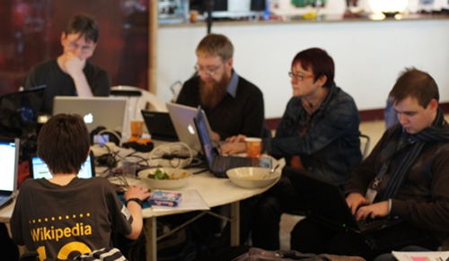
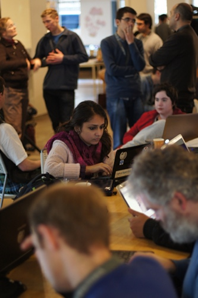
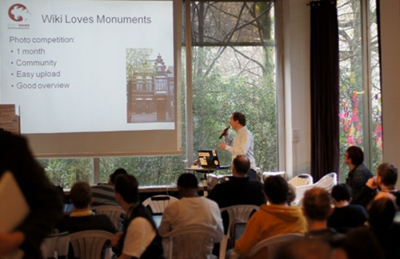

Ce week-end, Amsterdam accueillait la réunion Wikimedia GLAMcamp ([GLAM](http://outreach.wikimedia.org/wiki/GLAM) pour *Galleries, Libraries, Archives, Museums*). Des animateurs de l'encyclopédie en ligne de tous pays se rencontraient pour partager leurs expériences.

{.center}

{.right}
[Au programme](http://wmnederland.nl/2011/11/07/tweede-editie-van-het-wikimedia-glamcamp-komt-naar-amsterdam/), des brainstorms, des exposés et des hacking sessions sur le partage des connaissances et l'incitation au partage des connaissances. En France comme aux Pays-Bas, la célèbre encyclopédie en ligne Wikipedia est représentée par une association locale[^1] Ces dernières font un travail de fond avec les responsables des galeries, des bibliothèques, des musées, pour que les fonds de ces institutions soient mis en valeur en enrichissant l'encyclopédie libre.

Le travail le plus difficile est de convaincre les responsables de ces organismes publics que les licences restrictives nuisent à la bonne diffusion des œœuvres et du savoir. En France, les musées et les archives publiques conservent, entre autres, des œuvres et documents anciens qui devraient être domaine public, mais se réservent les droits de reproduction pour couvrir les couts de conservation. Au résultat, les œuvres sont moins diffusées et moins accessibles. GLAM propose une autre approche en proposant à ces institutions d'adopter des [licences libres](http://fr.wikipedia.org/wiki/Licence_libre) et d'organiser la numérisation de leur fond afin de développer leur renommé. 

La rencontre de cette semaine a montré quelques cas où l'adoption de cette politique est couronnée de succès. Le musée Stedelijk et le Tropenmuseum sont venu parler de leur projets. Mais j'ai surtout aimé l'histoire du museum de Toulouse qui a photographié une partie de ses collections en Janvier 2011 pour [les partager sur Wikipedia](http://commons.wikimedia.org/wiki/Category:Collections_of_the_Mus%C3%A9um_de_Toulouse). Un musée de paléontologie italien y a repéré la qualité de ses pièces et a proposé d'organiser une exposition temporaire. Depuis lors, une partie de la collection du museum de Toulouse tourne en Europe.

<!-- HTML -->

<!-- / HTML -->
{.center}

Le week-end a aussi évoqué l'opération [Wiki loves Monuments](http://www.wikilovesmonuments.eu/), une campagne européenne de photographie des monuments historiques. La France, tout comme les Pays-Bas s'y sont essayé en septembre dernier avec un grand succès. On parle déjà d'organiser la même opération l'année prochaine.
---
[^1]: [Wikimedia France](http://www.wikimedia.fr/) et [Wikimedia Nederland](http://wmnederland.nl/) dans leurs pays respectifs.