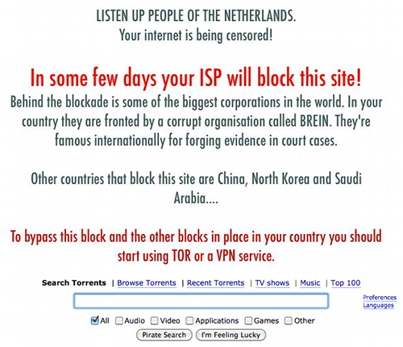

2012 ne commence pas bien pour l'internet. Aux États-Unis, la bataille autour de [la proposition de loi SOPA](http://fr.wikipedia.org/wiki/SOPA) présage une censure de l'Internet basée sur les noms de domaines, avec tous les dommages collatéraux que ce la implique. Aux Pays-Bas, pas encore de loi mais déjà une décision judiciaire vient d'ordonner deux fournisseurs d'accès de **filtrer 3 IPs et 24 noms de domaines**. Décision exécutoire avant le 21 janvier.

Les associations de racket autour du droits d'auteurs n'ont pas réussi à faire fermer le site **The Pirate Bay**, fournisseur de fichiers torrents permettant de télécharger des fichiers avec ce protocole. Ce, malgré plusieurs actions de justice notamment en Suède, pays de naissance du Pirate Bay.

Devant cette impuissance, l'association corporatiste [BREIN](http://fr.wikipedia.org/wiki/Bescherming_Rechten_Entertainment_Industrie_Nederland), a attaqué le câblo-opérateur **Ziggo** et le fournisseur d'accès **XS4ALL** afin qu'il bloquent l'accès à ce site pour leurs utilisateurs. C'est un tribunal civil à la Haye qui a été saisi et [la décision est tombée](http://zoeken.rechtspraak.nl/detailpage.aspx?ljn=BV0549&u_ljn=BV0549)[^1] le mercredi 11 janvier, laissant 10 jours aux FAI pour s’exécuter Ils doivent bloquer 3 adresses IPv4 et 24 noms de domaine/sous domaines.

De mémoire, je crois que c'est la première fois en Europe qu'une censure est ordonnée sur la base d'une liste de noms de domaines. Il semblerait que ce soit plutôt des [URL](http://fr.wikipedia.org/wiki/URL) qui soient listés puisque des noms de domaines apparaissent avec et sans le *www*.

Les deux fournisseurs d'accès profitent de la publicité qui leur est faite. Ils ont décidé de faire appel et déjà les critiques se multiplient contre ce jugement extrême. Certains expliquent que les preuves apporté par la fondation BREIN sont falsifiées, des députés **PVV** demandent à ce que le parlement se prononce sur ce jugement allant à l'encontre de la liberté d'expression et la page d'accueil de The Pirate Bay a changé pour l'occasion, on y **compare les Pays-Bas à la Corée-du-Sud**...

{.center}

Pendant ce temps d'autres groupes mettent en place des miroirs du site ce qui rend le jugement inefficace avant même d'avoir été exécuté...

### Lire aussi
* [La neutralité d'Internet à la sauce hollandaise](/La-neutralite-Internet-sauce-hollandaise)  
* [Pirate Bay pas vraiment bloqué aux Pays-Bas](/Pirate-Bay-pas-vraiment-bloque-aux-Pays-Bas)  
* [The Pirate Bay n'est plus bloqué aux Pays-Bas](/The-Pirate-Bay-n-est-plus-bloque-aux-Pays-Bas)  
---
[^1]: Si le verdict est trop long à lire, essayez l'[information diffusée par le tribunal à ce sujet](http://www.rechtspraak.nl/Organisatie/Rechtbanken/Den-Haag/Nieuws/Pages/Ziggo-en-XS4ALL-moeten-toegang-tot-The-Pirate-Bay-blokkeren.aspx)