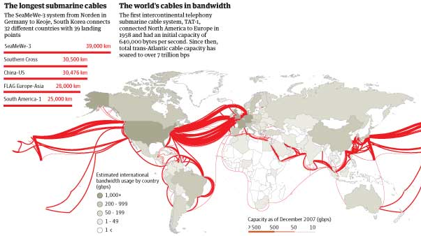
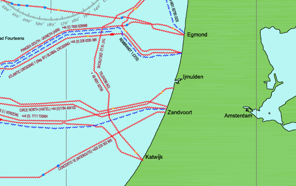

La mer du Nord est largement occupée par les câbles de toutes sortes. Parmi eux de nombreux **câbles de télécommunication** indispensables au bon fonctionnement de l'Internet.

[{.center}](http://image.guardian.co.uk/sys-images/Technology/Pix/pictures/2008/02/01/SeaCableHi.jpg)

<!--excerpt-->

Sur la carte mondiale des câbles sous-marin, on constate largement que le plus grand nombre d'entre eux relient les États-Unis à l'Europe. Parmi ces câbles la plus grande partie relie les États-Unis et le Royaume-Uni[^1]. La continuité des liaison est assuré par des dizaines de câbles filant dans les profondeurs de la mer du Nord. En face, il y a la France, la Belgique et les Pays-Bas. Ce dernier pays est le mieux relié des trois avec pas moins de 11 câbles en service arrivant sur les côtes bataves. La société d'information de pêche *Kingfisher* met en garde les pêcheurs en diffusant des cartes comme celle ci-dessous. Il faut faire attention aux câbles un peu partout dans la zone.

[{.center}](/files/NorthSea_KIS-ORCA-S_2015_Low-Res.pdf)

Il faut une bonne connexion pour être le [plus gros point d'échange du monde](/amsterdam-premier-point-d-echange-du-monde) Les Pays-Bas ont une liaison transatlantique directe avec [Atlantic Crossing](http://en.wikipedia.org/wiki/AC-1_%28cable_system%29) mais aussi des liaisons avec les pays voisins (France, Belgique, Allemagne, Danemark). Il est à noter que la liaison avec la France, le câble [TAT-14](http://en.wikipedia.org/wiki/TAT-14) relie **Saint-Valéry-en-Caux** à **Katwijk**. Le câble relie ensuite **Norden** en Allemagne d'un coté et les États-Unis de l'autre. TAT-14, a une bonne capacité de 3,7 To/s ce qui a valut à Katwijk d'être cité comme point stratégique [dans les câbles diplomatiques de Wikileaks](http://www.nrc.nl/nieuws/2010/12/06/wikileaks-publiceert-meest-controversiele-stuk-tot-nu-toe/)[^2], mais ça, c'est une autre histoire de câbles...

---
[^1]: Comme on peut le voir en zoomant sur [la carte de Greg](http://www.cablemap.info/)
[^2]: Pour connaître l'exacte position stratégique d'arrivée du câble, il suffit d'[aller sur Wikimapia](http://wikimapia.org/18287200/nl/TAT-14-landing).
<!-- post notes:
http://image.guardian.co.uk/sys-images/Technology/Pix/pictures/2008/02/01/SeaCableHi.jpg
http://www.submarinecablemap.com/ 
http://www.cablemap.info/
http://www.kisca.org.uk/charts.htm
http://www.kis-orca.eu/downloads#.VXfe57yFb7B 
http://www.justmagic.com/GoogleMaps_SubmarineCables.html
--->
