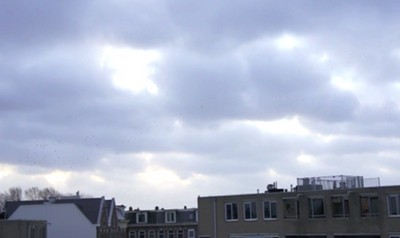

*Motregen*, c'est le nom de cette pluie fine qui tombe souvent ces temps ci. À Amsterdam, plus qu'ailleurs, le vent et l'humidité fait descendre la [température ressentie](/la-temperature-ressentie) bien en deçà de la température officielle annoncée par le thermomètre.

{.center}

*Motregen* veut dire **bruine** mais en plus désagréable, ce n'est pas une petite brise humide qui rafraichit, c'est un froid piquant qui mouille sans qu'on sen rende compte.

*Motregen* veut dire **crachin** de part la proximité sonore avec le khreukreu néerlandais et le truc spongieux qu'on n'aime pas recevoir sur le visage.

*Motregen* veut dire **temps de merde**.
---