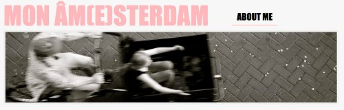

Le rythme de moins en moins soutenu de mes billets m'a empêché de vous présenter les nouveaux-venus sur la toile francophone amstellodamoise. Il s'agit de deux blogs présents dans mon lecteur RSS depuis quelque temps déjà. Deux approches d'Amsterdam différentes qui rafraichissent ma mémoire et ma vision des Pays-Bas.

**Marie Grandgirard** est arrivé à Amsterdam il y d'un an et elle a commencé son blog avant même de trouver un logement. Les billets, du quotidien futile à la recherche fouillée sont toujours intéressant, je sais pas comment elle fait.

[{.center}](http://monamsterdam.wordpress.com/about/)

**Anne Pailhes** est plus habituées des Pays-Bas puisqu'elle les a parcourus à plusieurs reprises avant de s'y installer. Il ne faut pas rater ses **mots de la semaine**, un peu comme mes **nouveaux mots** occasionnels mais avec des envolées lyriques en sus. 

[{.center}](http://lapapayebatave.wordpress.com/about/)
